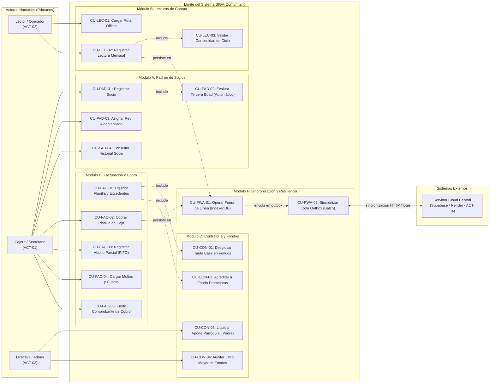

# ESPECIFICACIÓN DE CASOS DE USO DE SOFTWARE
## SISTEMA INTEGRAL DE GESTIÓN DE AGUA POTABLE Y ALCANTARILLADO (SIGA-COMUNITARIO)
### Junta Administradora de Agua Potable y Alcantarillado de la Parroquia Pishilata

---

**Norma de Referencia:** Estándar IEEE 830 / ISO/IEC/IEEE 29148:2018 / Formato Estándar Alistair Cockburn  
**Documento Fuente:** Especificación de Requerimientos de Software (SRS v1.0.0) y Contrato de Desarrollo de Software (Ambato, 27 Septiembre 2026)  
**Versión del Documento:** 1.0.0 (Aprobada)  
**Fecha de Emisión:** Octubre de 2026  
**Autor:** Ricardo Andrés Monge Miño (Desarrollador)  
**Destinatarios:** Junta Directiva (Patricio Chango - Presidente, Elsa Miño - Secretaria, Serafín Muzo - Tesorero) y Equipo Técnico  

---

## 1. INTRODUCCIÓN Y CONTEXTO OPERATIVO

### 1.1 Propósito
El presente documento describe detalladamente la especificación formal de los **Casos de Uso (CU)** del sistema **SIGA-Comunitario**, definiendo las interacciones funcionales entre los distintos actores (personal administrativo, operadores de campo, directiva) y la plataforma PWA Offline-First. 

### 1.2 Alcance del Sistema
El sistema cubre la gestión del padrón de socios, la micromedición móvil fuera de línea en rutas rurales, el motor de facturación algorítmica (con base estándar de 30 $m^3$ y cálculo de excedentes), la contraloría automatizada en esquema de Libro Mayor para los fondos comunitarios (Promejoras, Aporte Eclesiástico, Mortuorio, Alcantarillado y Operación), la cobranza con abonos cronológicos y la reportería periódica.

### 1.3 Actores del Sistema
| Identificador | Actor | Tipo | Responsabilidad en el Sistema |
| :--- | :--- | :--- | :--- |
| **ACT-01** | **Cajero / Secretario** | Humano (Primario) | Administra socios, emite facturas, recauda pagos en caja, registra abonos parciales, asigna multas y genera comprobantes físicos/digitales. |
| **ACT-02** | **Lector (Operador de Campo)** | Humano (Primario) | Opera la PWA en dispositivos móviles Android para capturar lecturas en medidores domiciliarios, validar saltos de consumo y documentar anomalías. |
| **ACT-03** | **Administrador / Directiva** | Humano (Primario) | Supervisa libros mayores de fondos, aprueba egresos, liquida aportes parroquiales y consulta balances periódicos consolidados. |
| **ACT-04** | **Servidor Cloud Central (Supabase / Render)** | Sistema Externo (Secundario) | Backend en la nube que autentica tokens JWT, persiste la base de datos canónica y recibe los lotes de sincronización. |

> **Principio de Modelado UML (OMG):**  
> Los componentes internos de la aplicación (como el Service Worker, IndexedDB, el SyncEngine o los motores algorítmicos internos) residen **dentro del límite del sistema** (*System Boundary*). Por lo tanto, no son actores. Las mutaciones son generadas por los actores humanos (**Lector** o **Cajero**) y el sistema las sincroniza de forma transparente con el actor externo secundario (**Servidor Cloud Central**).

---

## 2. DIAGRAMA GENERAL DE CASOS DE USO (UML)


        CU_FAC_02["CU-FAC-02: Cobrar Planilla en Caja"]
        CU_FAC_03["CU-FAC-03: Registrar Abono Parcial (FIFO)"]
        CU_FAC_04["CU-FAC-04: Cargar Multas y Cuotas"]
        CU_FAC_05["CU-FAC-05: Emitir Comprobante de Cobro"]
    end

    subgraph ModuloContraloria["Módulo D: Contraloría y Fondos"]
        CU_CON_01["CU-CON-01: Desglosar Tarifa Base en Fondos"]
        CU_CON_02["CU-CON-02: Acreditar a Fondo Promejoras"]
        CU_CON_03["CU-CON-03: Liquidar Aporte Parroquial (Padre)"]
        CU_CON_04["CU-CON-04: Auditar Libro Mayor de Fondos"]
    end

    subgraph ModuloSync["Módulo F: Sincronización PWA"]
        CU_PWA_01["CU-PWA-01: Operar Fuera de Línea (IndexedDB)"]
        CU_PWA_02["CU-PWA-02: Sincronizar Cola Outbox (Batch)"]
    end

    A_Cajero --> CU_PAD_01
    A_Cajero --> CU_PAD_03
    A_Cajero --> CU_PAD_04
    A_Cajero --> CU_FAC_02
    A_Cajero --> CU_FAC_03
    A_Cajero --> CU_FAC_04
    A_Cajero --> CU_FAC_05

    CU_PAD_01 -.->|include| CU_PAD_02
    CU_FAC_01 -.->|include| CU_CON_01
    CU_FAC_01 -.->|include| CU_CON_02

    A_Lector --> CU_LEC_01
    A_Lector --> CU_LEC_02
    CU_LEC_02 -.->|include| CU_LEC_03

    A_Directiva --> CU_CON_03
    A_Directiva --> CU_CON_04

    A_Sync --> CU_PWA_01
    A_Sync --> CU_PWA_02
```

---

## 3. ESPECIFICACIÓN DETALLADA DE CASOS DE USO

---

### MÓDULO A: PADRÓN DE SOCIOS Y GESTIÓN DE USUARIOS

#### [CU-PAD-01] Registrar Nuevo Socio en el Padrón
* **Identificador:** CU-PAD-01
* **Nombre:** Registrar Nuevo Socio en el Padrón General
* **Requerimiento Trazable:** [RF-PAD-01] y [RF-PAD-02] (Cláusula 2.1.A del Contrato)
* **Actor Principal:** Cajero / Secretario (ACT-01)
* **Actor Secundario:** Motor de Facturación Automática (ACT-05)
* **Prioridad:** Alta (Esencial)
* **Precondiciones:** El operador debe haber iniciado sesión en la PWA con rol autorizado (`cajero` o `admin`).
* **Postcondiciones (Éxito):**
  - El socio queda almacenado localmente en IndexedDB.
  - Se genera una mutación de creación en la cola `sync_queue` (Outbox).
  - Se evalúa de inmediato su condición de Tercera Edad.
* **Flujo Principal (Happy Path):**
  1. El Cajero accede a la vista *Padrón de Socios* y selecciona *Registrar Nuevo Socio*.
  2. El sistema despliega el formulario con los campos: Nombres, Apellidos, Cédula de Identidad, Fecha de Nacimiento, Fecha de Ingreso/Unión, Sector Geográfico, Número de Medidor y Checkbox de Alcantarillado.
  3. El Cajero ingresa los datos completos del socio.
  4. El sistema valida el formato de la cédula mediante el algoritmo de validación de módulo 10 de la República del Ecuador.
  5. El sistema invoca automáticamente el sub-flujo **CU-PAD-02** para determinar si el socio califica para la tarifa de Tercera Edad ($\ge 65$ años).
  6. El Cajero presiona el botón *Guardar Socio*.
  7. El sistema ejecuta una transacción atómica local en IndexedDB:
     - Inserta el registro del socio con identificador UUIDv4.
     - Asigna su estado operativo como `ACTIVO`.
     - Inserta el registro de su medidor asociado.
     - Encola la operación en `sync_queue` con estado `PENDING`.
  8. El sistema muestra un mensaje de confirmación en menos de 50 ms y actualiza la lista en pantalla.
* **Flujos Alternativos:**
  - *4a. Cédula Inválida:* El sistema notifica: *"La cédula ingresada no cumple con la validación de módulo 10 del Registro Civil"*. El operador rectifica el número y reintenta.
  - *4b. Cédula Duplicada:* Si la cédula ya existe en la base de datos local o remota, el sistema bloquea el guardado y ofrece abrir el perfil existente del socio.
* **Flujos de Excepción:**
  - *E1. Dispositivo sin conexión:* La transacción se completa íntegramente en la base de datos local IndexedDB; el sistema indica mediante un indicador visual amarillo que el registro se encuentra pendiente de sincronización en la nube.

---

#### [CU-PAD-02] Evaluar y Aplicar Subsidio por Tercera Edad (Automático)
* **Identificador:** CU-PAD-02
* **Nombre:** Evaluación Dinámica de Condición de Tercera Edad
* **Requerimiento Trazable:** [RF-PAD-02], [RF-FAC-02] (Cláusula 2.1.A del Contrato)
* **Actor Principal:** Motor de Facturación Automática (ACT-05)
* **Actor Secundario:** Cajero / Secretario (ACT-01)
* **Prioridad:** Alta (Regla de Negocio Legal)
* **Precondiciones:** Registro de socio existente o en proceso de creación con campo `fecha_nacimiento` debidamente estructurado ($AAAA-MM-DD$).
* **Postcondiciones:** Campo booleano `es_tercera_edad` actualizado y tarifa base asignada a **USD $5.00** en caso afirmativo.
* **Flujo Principal:**
  1. El sistema toma la fecha actual del sistema y la compara contra la `fecha_nacimiento` del socio.
  2. El sistema calcula la edad cronológica exacta:
     $$\text{Edad} = \left\lfloor \frac{\text{FechaReferencia} - \text{FechaNacimiento}}{365.25} \right\rfloor$$
  3. Si $\text{Edad} \ge 65$:
     - El sistema asigna `es_tercera_edad = true`.
     - Asigna el código de tarifa `TARIFA_SUBSIDIADA_3RA_EDAD` ($USD 5.00).
     - Muestra una insignia distintiva visual *"Tercera Edad (Ley Orgánica)"* en la ficha del socio.
  4. Si $\text{Edad} < 65$:
     - El sistema asigna `es_tercera_edad = false`.
     - Asigna el código de tarifa `TARIFA_ESTANDAR` ($USD 7.00).
* **Flujos Alternativos:**
  - *1a. Cambio de estado por cumplimiento de aniversario:* Al emitir las planillas mensuales de facturación, el sistema reevalúa la edad. Si un socio cumple los 65 años en el periodo facturado, adquiere automáticamente el subsidio a partir de dicha emisión sin requerir trámite manual.

---

#### [CU-PAD-03] Asignar o Modificar Servicio de Alcantarillado
* **Identificador:** CU-PAD-03
* **Nombre:** Asignación de Servicio de Red de Alcantarillado
* **Requerimiento Trazable:** [RF-PAD-03], [RF-FAC-03], [RF-CON-04] (Cláusula 2.1.A y 2.1.C del Contrato)
* **Actor Principal:** Cajero / Secretario (ACT-01)
* **Prioridad:** Media
* **Precondiciones:** Socio registrado en el sistema.
* **Postcondiciones:** Parámetro `tiene_alcantarillado` actualizado; afectación de recargo de **USD $1.00** mensual en la facturación subsiguiente.
* **Flujo Principal:**
  1. El Cajero busca al socio por cédula, nombre o código.
  2. Accede a la opción *Editar Servicios Especiales*.
  3. Activa o desactiva la casilla *Conexión a Red de Alcantarillado*.
  4. El sistema notifica al usuario: *"Al activar este servicio, se generará un cargo recurrente de USD 1.00 mensual acreditado al Fondo de Alcantarillado"*.
  5. El Cajero confirma la modificación.
  6. El sistema guarda el cambio en IndexedDB y encola la mutación en `sync_queue`.

---

### MÓDULO B: OPERATIVO DE MICROMEDICIÓN EN CAMPO (ROL LECTOR)

#### [CU-LEC-01] Cargar y Consultar Ruta de Lectura Fuera de Línea
* **Identificador:** CU-LEC-01
* **Nombre:** Carga y Preparación de Ruta de Lecturas Offline
* **Requerimiento Trazable:** [RF-LEC-01], [RF-PWA-01] (Cláusula 2.1.B y 2.2.2 del Contrato)
* **Actor Principal:** Lector / Operador de Campo (ACT-02)
* **Prioridad:** Alta (Crítica para operación en campo)
* **Precondiciones:** La PWA debe encontrarse instalada en el dispositivo móvil Android/Tablet del Lector con la sesión iniciada.
* **Postcondiciones:** La base de datos local IndexedDB contiene la totalidad de socios, medidores asignados y lecturas del periodo precedente.
* **Flujo Principal:**
  1. Antes de salir al recorrido de campo (con conexión Wi-Fi o datos), el Lector abre la PWA.
  2. El sistema sincroniza automáticamente y almacena en caché local:
     - Catálogo de socios agrupados por sector geográfico.
     - Número de serie del medidor domiciliario.
     - Histórico de la última lectura consolidada (Lectura Anterior).
  3. El Lector activa la vista *Ruta de Lectura* y selecciona su sector asignado (ej. *Sector Vía a Quillán*).
  4. El sistema presenta el listado ordenado de medidores con indicadores visuales: `PENDIENTE` (Gris) o `LEÍDO` (Verde).
  5. El Lector inicia el recorrido físico sin requerir conexión a internet activa.

---

#### [CU-LEC-02] Registrar Lectura Volumétrica Mensual del Medidor
* **Identificador:** CU-LEC-02
* **Nombre:** Toma y Registro de Lectura Mensual en Campo
* **Requerimiento Trazable:** [RF-LEC-01], [RF-LEC-02], [RF-LEC-03] (Cláusula 2.1.B del Contrato)
* **Actor Principal:** Lector / Operador de Campo (ACT-02)
* **Prioridad:** Alta (Crítica)
* **Precondiciones:** Socio cargado en la ruta de lectura del dispositivo local.
* **Postcondiciones:** Registro de lectura persistido en IndexedDB local con cálculo de consumo volumétrico en $m^3$ y encolado en `sync_queue`.
* **Flujo Principal:**
  1. El Lector localiza el medidor del socio en el domicilio.
  2. En la PWA, selecciona el socio (por código, apellido o número de medidor).
  3. El sistema muestra los datos del socio, el número de serie de medidor y la **Lectura Anterior** ($L_{anterior}$) precargada de forma obligatoria no editable.
  4. El Lector ingresa el valor numérico visible en el cuadrante del medidor físico en el campo **Lectura Actual** ($L_{actual}$).
  5. Opcionalmente, ingresa observaciones de novedad (ej. *"Tapa rota"*, *"Medidor enterrado"*, *"Fuga antes de llave de paso"*).
  6. El sistema invoca automáticamente **CU-LEC-03** para verificar la continuidad y consistencia del ciclo.
  7. El sistema calcula en pantalla el consumo volumétrico:
     $$\text{Consumo} = L_{actual} - L_{anterior}$$
  8. Si el consumo excede el límite estándar de 30 $m^3$, el sistema muestra una advertencia informativa con el cálculo estimado de excedente.
  9. El Lector presiona *Guardar Lectura*.
  10. El sistema guarda la lectura localmente en IndexedDB en menos de 50 ms, marca el socio como `LEÍDO` en la ruta y encola el evento en `sync_queue`.
  11. La interfaz avanza automáticamente al siguiente socio de la ruta programada.
* **Flujos Alternativos:**
  - *5a. Medidor Inaccesible / Trancado:* El Lector activa la casilla *"Sin acceso al medidor"* y registra la novedad en observaciones. El sistema registra la novedad y mantiene la lectura pendiente para visita de inspección.

---

#### [CU-LEC-03] Validar Continuidad de Ciclo e Inconsistencia de Lectura
* **Identificador:** CU-LEC-03
* **Nombre:** Validación de Continuidad de Ciclo y Control de Saltos
* **Requerimiento Trazable:** [RF-LEC-02], [RF-LEC-03] (Cláusula 2.1.B del Contrato)
* **Actor Principal:** Motor de Facturación / PWA (ACT-05)
* **Actor Secundario:** Lector (ACT-02)
* **Prioridad:** Alta
* **Precondiciones:** El operador ingresó un valor en $L_{actual}$.
* **Postcondiciones:** La lectura es aceptada con bandera de verificación o rechazada para corrección.
* **Flujo Principal:**
  1. El sistema verifica que $L_{actual}$ sea un número mayor o igual a $L_{anterior}$.
  2. Si $L_{actual} \ge L_{anterior}$, se aprueba el cálculo $\text{Consumo} = L_{actual} - L_{anterior}$ y el flujo continúa con normalidad.
* **Flujos Alternativos:**
  - *1a. Lectura Menor a la Anterior ($L_{actual} < L_{anterior}$):*
    1. El sistema bloquea el guardado directo y despliega un diálogo de advertencia modal:
       *"ALERTA DE INCONSISTENCIA: La lectura actual ($X m^3$) es inferior a la lectura anterior registrada ($Y m^3$)."*
    2. El Lector debe verificar si se trata de un error tipográfico o si existió reemplazo/reseteo físico del medidor.
    3. Si fue un error de tipeo, el Lector rectifica el valor.
    4. Si se confirma sustitución de medidor o reinicio a 0000 por vuelta de contador, el Lector selecciona la opción *"Medidor Reemplazado / Reiniciado"* e ingresa una justificación obligatoria.
  - *1b. Salto Abrupto de Consumo ($\text{Consumo} > 100 m^3$):*
    1. El sistema solicita confirmación mediante doble digitación para prevenir errores accidentales antes de permitir el guardado.

---

### MÓDULO C: MOTOR DE FACTURACIÓN Y LIQUIDACIÓN MENSUAL

#### [CU-FAC-01] Liquidar Planilla Mensual de Consumo y Excedentes
* **Identificador:** CU-FAC-01
* **Nombre:** Liquidación Algorítmica de Planilla Mensual
* **Requerimiento Trazable:** [RF-FAC-01], [RF-FAC-02], [RF-FAC-03], [RF-FAC-05] (Cláusula 2.1.C del Contrato)
* **Actor Principal:** Motor de Facturación Automática (ACT-05)
* **Actor Secundario:** Cajero / Secretario (ACT-01)
* **Prioridad:** Alta (Núcleo Financiero)
* **Precondiciones:** Lectura mensual ingresada y confirmada en el periodo de liquidación.
* **Postcondiciones:** Factura/Planilla generada con desglose de todos los rubros, deudas anteriores consolidadas y asignación de fondos contables.
* **Flujo Principal:**
  1. El sistema procesa los datos del consumo registrado para el socio en el periodo facturado:
     $$\text{Consumo} = L_{actual} - L_{anterior}$$
  2. Determina la **Tarifa Base**:
     - Si `es_tercera_edad == true`, fija $\text{TarifaBase} = \text{USD } 5.00$.
     - Si `es_tercera_edad == false`, fija $\text{TarifaBase} = \text{USD } 7.00$.
  3. Calcula el **Excedente de Consumo**:
     $$\text{Excedente}_{m^3} = \max(0, \text{Consumo} - 30)$$
     $$\text{MontoExcedente} = \text{Excedente}_{m^3} \times \text{USD } 0.10$$
  4. Calcula el **Rubro de Alcantarillado**:
     - Si `tiene_alcantarillado == true`, $\text{RubroAlcantarillado} = \text{USD } 1.00$.
     - Caso contrario, $\text{RubroAlcantarillado} = \text{USD } 0.00$.
  5. Suma las multas por inasistencia y cuotas extraordinarias no canceladas del socio:
     $$\text{RubrosComplementarios} = \sum \text{Multas} + \sum \text{CuotasExtraordinarias}$$
  6. Consulta el saldo acumulado histórico pendiente de periodos previos ($\text{CarteraVencida}$).
  7. Calcula el **Total a Pagar**:
     $$\text{TotalPlanilla} = \text{TarifaBase} + \text{MontoExcedente} + \text{RubroAlcantarillado} + \text{RubrosComplementarios} + \text{CarteraVencida}$$
  8. Guarda el documento de planilla con estado `PENDIENTE_PAGO`.

---

#### [CU-FAC-02] Cobrar Planilla Mensual en Ventanilla / Caja
* **Identificador:** CU-FAC-02
* **Nombre:** Recaudación de Planilla de Agua en Caja
* **Requerimiento Trazable:** [RF-FAC-05], [RF-FAC-06] (Cláusula 2.1.C del Contrato)
* **Actor Principal:** Cajero / Secretario (ACT-01)
* **Prioridad:** Alta (Operativa Diaria)
* **Precondiciones:** Socio con planilla emitida o saldo deudor pendiente en el sistema.
* **Postcondiciones:** Registro de cobro efectuado, saldo de la factura actualizado a `PAGADA`, comprobante emitido y desgloses contables impactados en libros mayores de fondos.
* **Flujo Principal:**
  1. El socio se acerca a la ventanilla de la Junta Administradora.
  2. El Cajero abre el módulo *Caja / Cobros* e ingresa la cédula o nombre del socio.
  3. El sistema muestra la ficha consolidada: datos personales, estado de tercera edad, desglose de la planilla del mes actual (base, excedente, alcantarillado) y detalle de meses anteriores en mora si existieren.
  4. El socio realiza el pago íntegro en efectivo o transferencia.
  5. El Cajero ingresa el monto recibido y el método de pago (`EFECTIVO`, `TRANSFERENCIA`).
  6. El Cajero presiona *Procesar Cobro*.
  7. El sistema ejecuta una transacción atómica local:
     - Genera un registro en la tabla `cobros` con folio correlativo único.
     - Cambia el estado de la factura a `PAGADA`.
     - Invoca automáticamente **CU-CON-01** y **CU-CON-02** para realizar los asientos en los libros mayores de fondos.
     - Encola la operación en `sync_queue`.
  8. El sistema abre la ventana de impresión térmica/digital del comprobante (**CU-FAC-05**).

---

#### [CU-FAC-03] Registrar Abono Parcial Cronológico (No Destructivo / FIFO)
* **Identificador:** CU-FAC-03
* **Nombre:** Registro de Abonos Parciales por Antigüedad
* **Requerimiento Trazable:** [RF-FAC-06] (Cláusula 2.1.C del Contrato)
* **Actor Principal:** Cajero / Secretario (ACT-01)
* **Prioridad:** Alta (Requerimiento Contractual Explícito)
* **Precondiciones:** Socio con saldo pendiente acumulado en cartera vencida.
* **Postcondiciones:** Monto abonado aplicado estrictamente a las deudas más antiguas sin anular ni sobreescribir las facturas de meses posteriores; saldo remanente recalculado.
* **Flujo Principal:**
  1. El Cajero consulta la deuda acumulada del socio (ej. Deuda total acumulada: USD $35.00 correspondientes a 4 meses).
  2. El socio manifiesta que solo puede abonar una suma parcial (ej. USD $15.00).
  3. El Cajero selecciona la opción *Registrar Abono Parcial* e ingresa el monto de $15.00.
  4. El sistema ejecuta el algoritmo de imputación cronológica **FIFO (First-In, First-Out)**:
     - Toma las deudas ordenadas de la más antigua a la más reciente.
     - Si la deuda del mes más antiguo es de $7.00, se marca como `PAGADA CON ABONO` y el saldo restante del abono ($8.00) pasa al mes siguiente.
     - Si la deuda del siguiente mes es de $7.00, se liquida totalmente y el saldo restante ($1.00) amortiza parcialmente el tercer mes.
     - La factura del tercer mes conserva su estado como saldo parcial pendiente por $6.00 con su fecha exacta de emisión histórica.
     - Las facturas de los meses más recientes se mantienen intactas e inalteradas en el sistema.
  5. El sistema emite el comprobante de caja detallando:
     - Monto abonado.
     - Facturas canceladas y cuota amortizada.
     - Saldo deudor remanente consolidado.
  6. El sistema encola la mutación en `sync_queue`.

---

#### [CU-FAC-04] Cargar Rubros Complementarios (Multas y Cuotas)
* **Identificador:** CU-FAC-04
* **Nombre:** Aplicación de Multas por Inasistencia y Cuotas Extraordinarias
* **Requerimiento Trazable:** [RF-FAC-04], [RF-CON-05] (Cláusula 2.1.C y 2.1.D del Contrato)
* **Actor Principal:** Cajero / Secretario (ACT-01)
* **Prioridad:** Media
* **Precondiciones:** Sesión administrativa iniciada.
* **Postcondiciones:** Rubro cargado a la cuenta del socio individual o de forma colectiva a un sector/padrón completo.
* **Flujo Principal:**
  1. El Cajero selecciona la opción *Gestión de Multas y Cuotas*.
  2. Selecciona la modalidad: *Carga Individual* o *Carga Masiva por Sector/Asamblea*.
  3. Especifica el concepto contractual:
     - `MULTA_MINGA`: Inasistencia a trabajos comunitarios / mingas de mantenimiento.
     - `MULTA_ASAMBLEA`: Inasistencia a asambleas generales ordinarias/extraordinarias.
     - `CUOTA_EXTRAORDINARIA`: Aporte fijado por la Junta Directiva para obras comunitarias.
  4. Ingresa el valor en dólares y la fecha del evento.
  5. Confirma la aplicación.
  6. El sistema vincula el rubro como cuenta por cobrar pendiente en la próxima planilla mensual del socio y genera el registro de auditoría correspondiente.

---

#### [CU-FAC-05] Emitir Comprobante / Recibo de Pago
* **Identificador:** CU-FAC-05
* **Nombre:** Generación de Recibo de Pago Digital / Impreso
* **Requerimiento Trazable:** [RF-FAC-05], [RF-FAC-06] (Cláusula 2.1.C del Contrato)
* **Actor Principal:** Cajero / Secretario (ACT-01)
* **Actor Secundario:** Socio (Receptor)
* **Prioridad:** Alta
* **Precondiciones:** Transacción de cobro o abono exitosa en caja.
* **Postcondiciones:** Documento formateado para impresión en tiquetera de 80mm o descarga en formato PDF.
* **Flujo Principal:**
  1. Concluida la cobranza, el sistema genera automáticamente la vista previa del comprobante.
  2. El comprobante incluye obligatoriamente:
     - Encabezado formal: *"Junta Administradora de Agua Potable y Alcantarillado de Pishilata - Ambato"*.
     - Número de folio correlativo único de recibo.
     - Datos del socio: Nombres, cédula, código de abonado, sector geográfico.
     - Datos volumétricos: Lectura anterior, lectura actual, consumo volumétrico ($m^3$) y excedente.
     - Desglose monetario: Tarifa base, rubro de alcantarillado, valor de excedentes, multas/cuotas.
     - Estado de cartera: Deuda anterior abonada, saldo pendiente remanente.
     - Firma de responsabilidad del Cajero y fecha/hora exacta de la operación.
  3. El Cajero selecciona *Imprimir Ticket* o *Compartir Comprobante Digital*.

---

### MÓDULO D: CONTRALORÍA, LIBRO MAYOR Y DISTRIBUCIÓN DE INGRESOS

#### [CU-CON-01] Desglosar Tarifa Base en Fondos Contables
* **Identificador:** CU-CON-01
* **Nombre:** Distribución Automática de Fondos de la Tarifa Base
* **Requerimiento Trazable:** [RF-CON-01], [RF-CON-02] (Cláusula 2.1.D del Contrato)
* **Actor Principal:** Motor de Facturación Automática (ACT-05)
* **Prioridad:** Alta (Mandato Contractual de Transparencia Financiera)
* **Precondiciones:** Cobro de tarifa base registrado en caja (`CU-FAC-02`).
* **Postcondiciones:** Asientos contables automáticos en los Libros Mayores correspondientes.
* **Flujo Principal:**
  1. Al registrarse el pago de una planilla, el sistema detecta el valor cobrado por tarifa base.
  2. **Caso 1: Tarifa Base Estándar ($7.00):**
     - Acredita **USD $2.00** al *Fondo de Honorarios / Aporte Eclesiástico (Padre / Parroquia)*.
     - Acredita **USD $4.00** al *Fondo de Consumo Base y Mantenimiento del Sistema*.
     - Acredita **USD $0.50** al *Fondo de Compensación del Lector (Pago Operativo)*.
     - Acredita **USD $0.50** al *Fondo Mortuorio Comunitario*.
  3. **Caso 2: Tarifa Base Tercera Edad ($5.00):**
     - Acredita **USD $2.00** al *Fondo de Honorarios / Aporte Eclesiástico (Padre / Parroquia)*.
     - Acredita **USD $2.00** al *Fondo de Consumo Base y Mantenimiento del Sistema*.
     - Acredita **USD $0.50** al *Fondo de Compensación del Lector*.
     - Acredita **USD $0.50** al *Fondo Mortuorio Comunitario*.
  4. Para cada acreditación se crea un registro de *Ingreso* en `fondos_movimientos` con el ID del cobro como referencia de trazabilidad.

---

#### [CU-CON-02] Acreditar Recaudación de Excedentes al Fondo de Promejoras
* **Identificador:** CU-CON-02
* **Nombre:** Acreditación de Excedentes a Promejoras
* **Requerimiento Trazable:** [RF-CON-03] (Cláusula 2.1.D del Contrato)
* **Actor Principal:** Motor de Facturación Automática (ACT-05)
* **Prioridad:** Alta
* **Precondiciones:** Cobro efectuado que contemple valores liquidados por concepto de `monto_excedente` (consumo $> 30 m^3$).
* **Postcondiciones:** El 100% de la recaudación por excedente se suma al saldo del Fondo de Promejoras.
* **Flujo Principal:**
  1. El sistema evalúa el campo `monto_excedente` del cobro liquidado.
  2. Si `monto_excedente > 0`:
     - Genera un movimiento de tipo `INGRESO` en el libro contable de **Promejoras**.
     - El monto es exactamente igual al 100% recaudado por excedentes.
     - Asigna el concepto: *"Recaudación por Excedente de Consumo - Recibo #XXXX"*.
  3. El saldo acumulado de Promejoras se actualiza instantáneamente en el sistema.

---

#### [CU-CON-03] Gestionar y Liquidar Aportes Eclesiásticos (Fondo del Padre)
* **Identificador:** CU-CON-03
* **Nombre:** Seguimiento y Liquidación de Aportes a la Parroquia
* **Requerimiento Trazable:** [RF-CON-06] (Cláusula 2.1.D del Contrato)
* **Actor Principal:** Administrador / Directiva (Tesorero - ACT-03)
* **Prioridad:** Media
* **Precondiciones:** Fondos acumulados por concepto de $2.00/socio recaudados en el periodo.
* **Postcondiciones:** Asiento de egreso/desembolso en el libro mayor del Padre y saldo pendiente actualizado.
* **Flujo Principal:**
  1. El Tesorero ingresa al módulo *Contraloría / Fondos* y selecciona *Fondo del Padre / Aporte Eclesiástico*.
  2. El sistema muestra:
     - Total acumulado en el periodo por aportes devengados ($2.00 por cada tarifa cobrada).
     - Historial de entregas y liquidaciones previas efectuadas al párroco.
     - Saldo líquido pendiente de pago.
  3. El Tesorero selecciona la opción *Registrar Desembolso / Liquidación*.
  4. Ingresa el monto a liquidar, el número de comprobante/recibo entregado por la parroquia y notas adicionales.
  5. El sistema registra un movimiento de `EGRESO` en el Libro Mayor del Fondo del Padre, recalculando el saldo en tiempo real.

---

#### [CU-CON-04] Auditar Libro Mayor de Fondos Comunitarios
* **Identificador:** CU-CON-04
* **Nombre:** Auditoría Contable en Esquema de Libro Mayor
* **Requerimiento Trazable:** [RF-CON-07] (Cláusula 2.1.D del Contrato)
* **Actor Principal:** Administrador / Directiva (ACT-03)
* **Prioridad:** Alta (Rendición de Cuentas)
* **Precondiciones:** Usuario con perfil administrativo o de tesorería.
* **Postcondiciones:** Visualización íntegra de asientos contables con saldos en tiempo real y exportación de registros.
* **Flujo Principal:**
  1. El Directivo selecciona el fondo a consultar: *Promejoras*, *Aporte Parroquial*, *Consumo Base*, *Compensación Lector*, *Fondo Mortuorio* o *Red de Alcantarillado*.
  2. El sistema despliega el Libro Mayor estructurado en columnas:
     - `Fecha y Hora`
     - `Concepto Operativo`
     - `Referencia / Comprobante Asociado`
     - `Ingreso (Haber)`
     - `Egreso (Debe)`
     - `Saldo Acumulado Consolidado`
     - `Usuario Responsable`
  3. El usuario puede filtrar por rangos de fechas o descargar el extracto en formato CSV / PDF para auditorías en asamblea.

---

### MÓDULO E: INFORMES, ESTADÍSTICAS Y REPORTERÍA

#### [CU-REP-01] Generar Balances Consolidados Periódicos
* **Identificador:** CU-REP-01
* **Nombre:** Generación de Balances Periódicos (Trimestral / Semestral / Anual)
* **Requerimiento Trazable:** [RF-REP-01] (Cláusula 2.1.E del Contrato)
* **Actor Principal:** Administrador / Directiva (ACT-03)
* **Actor Secundario:** Cajero / Secretario (ACT-01)
* **Prioridad:** Alta
* **Precondiciones:** Registros de facturación y movimientos contables correspondientes al periodo solicitado.
* **Postcondiciones:** Documento consolidado generado con totales de ingresos, egresos, cartera pendiente y fondos de reserva.
* **Flujo Principal:**
  1. El usuario ingresa a la pestaña *Reportes y Balances*.
  2. Selecciona la periodicidad requerida conforme al contrato:
     - *Trimestral* (1er, 2do, 3er o 4to trimestre).
     - *Semestral* (1er o 2do semestre).
     - *Anual* (Consolidado de todo el ejercicio fiscal).
  3. El sistema procesa los registros y genera un informe estructurado que contiene:
     - Total recaudado por tarifa base ($7 y $5).
     - Total recaudado por excedentes volumétricos (destinado a Promejoras).
     - Total recaudado por servicio de alcantarillado.
     - Total de multas y cuotas comunitarias cobradas.
     - Cartera vencida pendiente de cobro.
     - Balance general de cada fondo en esquema Ingresos vs Egresos.
  4. El sistema permite imprimir o exportar el reporte formal para las asambleas generales de socios.

---

#### [CU-REP-02] Consultar Reporte Segmentado por Socio y Sector
* **Identificador:** CU-REP-02
* **Nombre:** Segmentación y Reportes Filtrables
* **Requerimiento Trazable:** [RF-REP-02] (Cláusula 2.1.E del Contrato)
* **Actor Principal:** Administrador / Directiva (ACT-03) o Cajero (ACT-01)
* **Prioridad:** Media
* **Precondiciones:** Existencia de datos históricos en el sistema.
* **Postcondiciones:** Reporte interactivo filtrado en pantalla.
* **Flujo Principal:**
  1. El usuario abre el módulo *Estadísticas y Segmentación*.
  2. Aplica filtros según la necesidad de análisis:
     - **Por Sector Geográfico:** Visualiza total recaudado, consumo volumétrico global en $m^3$ y porcentaje de socios en mora en dicho sector.
     - **Por Socio Individual:** Genera el estado de cuenta histórico de un socio específico, mostrando lecturas mes a mes, pagos realizados y saldos pendientes.
     - **Totales Generales:** Métricas cuantitativas del volumen total de agua consumida versus el monto financiero recaudado.
  3. El sistema actualiza los gráficos y tablas analíticas de forma dinámica.

---

### MÓDULO F: MOTOR PWA Y SINCRONIZACIÓN FUERA DE LÍNEA (OFFLINE-FIRST)

#### [CU-PWA-01] Operar Fuera de Línea en la Base Local (IndexedDB)
* **Identificador:** CU-PWA-01
* **Nombre:** Persistencia Primaria Local y Operación Offline
* **Requerimiento Trazable:** [RF-PWA-01], [RNF-REN-01] (Cláusula 2.2.2 del Contrato)
* **Actor Principal:** Lector (ACT-02) o Cajero (ACT-01)
* **Actor Secundario:** Motor de Almacenamiento IndexedDB
* **Prioridad:** Alta (Pilar de la Arquitectura del Sistema)
* **Precondiciones:** Dispositivo con navegador compatible y PWA instalada previamente.
* **Postcondiciones:** Operaciones guardadas en `siga_offline_db` con latencia $<50$ ms sin dependencia de conectividad celular o de red.
* **Flujo Principal:**
  1. El usuario realiza una acción en la interfaz (ej. registrar lectura o procesar cobro).
  2. La aplicación detecta que no hay conexión a internet (`navigator.onLine === false`) o prioriza la persistencia local.
  3. Se abre una transacción de lectura/escritura (`readwrite`) en el almacén de objetos de IndexedDB (`siga_offline_db`).
  4. Se actualizan las tablas correspondientes (`socios`, `medidores`, `lecturas`, `cobros`, `fondos_movimientos`).
  5. Se inserta un registro en la tabla `sync_queue` con estado `PENDING`, ID de entidad, acción (`CREATE` o `UPDATE`) y payload serializado en JSON.
  6. La UI responde de inmediato (<50 ms) notificando al usuario que la acción fue guardada localmente con éxito.

---

#### [CU-PWA-02] Sincronizar Cola Outbox con Supabase y Servidor Cloud
* **Identificador:** CU-PWA-02
* **Nombre:** Sincronización Automática por Lotes (Outbox Pattern)
* **Requerimiento Trazable:** [RF-PWA-03], [RNF-CON-02] (Cláusula 2.2.1 y 2.2.3 del Contrato)
* **Actor Principal:** Motor de Sincronización - SyncEngine (ACT-04)
* **Prioridad:** Alta (Garantía de Consistencia y Replicación)
* **Precondiciones:** Existencia de registros en estado `PENDING` en `sync_queue` y restablecimiento de la conexión a internet.
* **Postcondiciones:** Registros locales actualizados a estado `SYNCED` y base central PostgreSQL en Supabase consolidada.
* **Flujo Principal:**
  1. El navegador detecta el evento de reconexión (`window.addEventListener('online')`) o el temporizador del `SyncEngine` activa un ciclo de verificación.
  2. El `SyncEngine` consulta en IndexedDB si existen transacciones con estado `PENDING` en `sync_queue`.
  3. Si existen registros, agrupa las mutaciones en un lote (batch) de hasta 50 operaciones.
  4. Realiza una petición segura `POST /api/v1/sync` (o hacia los endpoints REST de Supabase) enviando el paquete de cambios junto con el token de autorización JWT.
  5. El servidor en la nube (Render) valida la integridad de cada mutación:
     - Aplica las operaciones en la base de datos PostgreSQL de Supabase.
     - En caso de concurrencia sobre la misma entidad, aplica resolución de conflictos determinista basada en marcas de tiempo **LWW (Last-Write-Wins)**.
  6. El servidor responde con un array de reconocimientos de éxito (`acknowledgments / acks`) y los deltas generados por otros usuarios si existieren.
  7. El cliente recibe la respuesta:
     - Marca los elementos locales de `sync_queue` como `SYNCED` (o los purga).
     - Actualiza el indicador visual de la interfaz a verde: *"Sistema sincronizado con la nube"*.
* **Flujos Alternativos:**
  - *4a. Falla de conexión a mitad del envío:* La petición genera error de red. El `SyncEngine` mantiene los registros en estado `PENDING`, incrementa el contador `retryCount` y reprograma la sincronización tras un intervalo con respaldo exponencial (*exponential backoff*). Ningún dato se pierde ni se corrompe en el dispositivo local.

---

## 4. MATRIZ DE TRAZABILIDAD (CASOS DE USO vs REQUERIMIENTOS DEL SRS)

| Caso de Uso (CU) | Requerimiento Funcional (SRS) | Cláusula del Contrato | Actor Principal |
| :--- | :--- | :--- | :--- |
| **CU-PAD-01** | `RF-PAD-01`, `RF-PAD-02` | Cláusula 2.1.A | Cajero / Secretario |
| **CU-PAD-02** | `RF-PAD-02`, `RF-FAC-02` | Cláusula 2.1.A, 2.1.C | Motor Automático |
| **CU-PAD-03** | `RF-PAD-03`, `RF-FAC-03` | Cláusula 2.1.A, 2.1.C | Cajero / Secretario |
| **CU-PAD-04** | `RF-PAD-01`, `RF-REP-02` | Cláusula 2.1.A, 2.1.E | Cajero / Administrador |
| **CU-LEC-01** | `RF-LEC-01`, `RF-PWA-01` | Cláusula 2.1.B, 2.2.2 | Lector de Campo |
| **CU-LEC-02** | `RF-LEC-01`, `RF-LEC-03` | Cláusula 2.1.B | Lector de Campo |
| **CU-LEC-03** | `RF-LEC-02`, `RF-LEC-03` | Cláusula 2.1.B | Motor PWA / Lector |
| **CU-FAC-01** | `RF-FAC-01`, `RF-FAC-02`, `RF-FAC-03` | Cláusula 2.1.C | Motor de Facturación |
| **CU-FAC-02** | `RF-FAC-05`, `RF-FAC-06` | Cláusula 2.1.C | Cajero / Secretario |
| **CU-FAC-03** | `RF-FAC-06` | Cláusula 2.1.C | Cajero / Secretario |
| **CU-FAC-04** | `RF-FAC-04`, `RF-CON-05` | Cláusula 2.1.C, 2.1.D | Cajero / Secretario |
| **CU-FAC-05** | `RF-FAC-05`, `RF-FAC-06` | Cláusula 2.1.C | Cajero / Secretario |
| **CU-CON-01** | `RF-CON-01`, `RF-CON-02` | Cláusula 2.1.D | Motor Automático |
| **CU-CON-02** | `RF-CON-03` | Cláusula 2.1.D | Motor Automático |
| **CU-CON-03** | `RF-CON-06` | Cláusula 2.1.D | Tesorero / Directiva |
| **CU-CON-04** | `RF-CON-07` | Cláusula 2.1.D | Directiva / Administrador |
| **CU-REP-01** | `RF-REP-01` | Cláusula 2.1.E | Directiva / Cajero |
| **CU-REP-02** | `RF-REP-02` | Cláusula 2.1.E | Directiva / Cajero |
| **CU-PWA-01** | `RF-PWA-01`, `RNF-REN-01` | Cláusula 2.2.2 | Lector / Cajero |
| **CU-PWA-02** | `RF-PWA-03`, `RNF-CON-02` | Cláusula 2.2.1, 2.2.3 | SyncEngine (Automático) |

---

### APROBACIÓN TÉCNICA DEL DOCUMENTO

El presente documento de especificación formal de casos de uso refleja con exactitud la arquitectura funcional y operativa pactada para el sistema **SIGA-Comunitario**:

```
_______________________________________               _______________________________________
Ricardo Andrés Monge Miño                             Patricio Chango
Desarrollador del Sistema                             Presidente - Junta de Agua Potable


_______________________________________               _______________________________________
Elsa Miño                                             Serafín Muzo
Secretaria - Junta de Agua Potable                    Tesorero - Junta de Agua Potable
```
