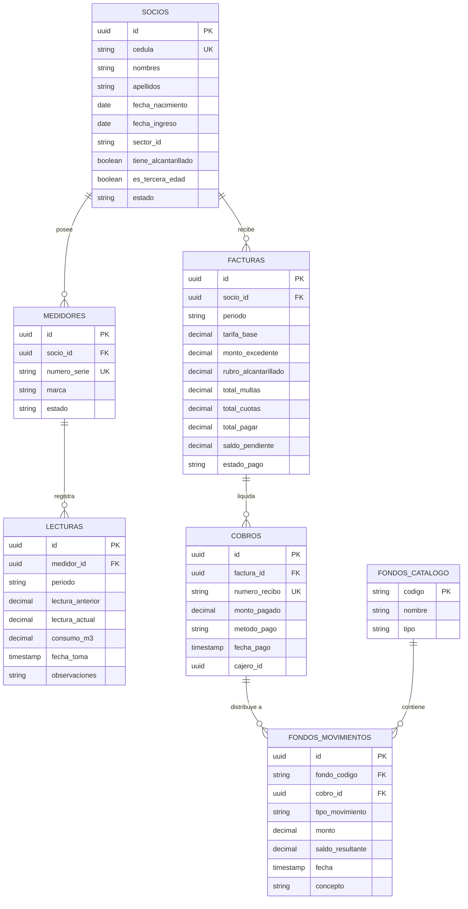

# ESPECIFICACIÓN DE REQUERIMIENTOS DE SOFTWARE (SRS)
## SISTEMA INTEGRAL DE GESTIÓN DE AGUA POTABLE Y ALCANTARILLADO (SIGA-COMUNITARIO)
### Junta Administradora de Agua Potable y Alcantarillado de la Parroquia Pishilata

---

**Norma de Referencia:** Basado en el estándar IEEE 830 / ISO/IEC/IEEE 29148:2018  
**Documento Contractual Base:** Contrato de Desarrollo de Software celebrado el 27 de Septiembre de 2026 (Ambato, Ecuador)  
**Versión del SRS:** 1.0.0 (Final - Aprobada)  
**Fecha de Emisión:** Octubre de 2026  
**Autor / Desarrollador:** Ricardo Andrés Monge Miño (C.I. 1850270867)  
**Cliente / Contratante:** Junta Directiva del Sistema de Agua Potable y Alcantarillado de la Parroquia Pishilata  
- Patricio Chango (Presidente)  
- Elsa Miño (Secretaria - C.I. 1803443116)  
- Serafín Muzo (Tesorero)  
**Ubicación de Implementación:** Parroquia Pishilata, Vía a Quillán, Cantón Ambato, Provincia de Tungurahua, Ecuador.

---

## 1. INTRODUCCIÓN

### 1.1 Propósito del Documento
El presente documento de **Especificación de Requerimientos de Software (SRS)** formaliza y consolida la totalidad de los requerimientos funcionales, requerimientos no funcionales, reglas de negocio, arquitectura tecnológica, modelo de persistencia y restricciones operativas del sistema **SIGA-Comunitario**. Este documento deriva directamente de los términos, alcances técnicos y cláusulas de negocio acordadas en el *Contrato de Desarrollo de Software* suscrito entre el Desarrollador Ricardo Andrés Monge Miño y la Junta Administradora de Agua Potable y Alcantarillado de la Parroquia Pishilata.

El propósito principal es proporcionar una línea base técnica vinculante y verificable para el ciclo de vida del sistema, gobernando el proceso de aceptación, auditoría funcional, soporte técnico y evolución del aplicativo.

### 1.2 Alcance del Producto (Product Scope)
**SIGA-Comunitario** es una solución de software empresarial bajo la modalidad de **Aplicación Web Progresiva (PWA)** con arquitectura **Offline-First / Local-First**. Está diseñada para automatizar, blindar contablemente y digitalizar de punta a punta la administración del servicio de agua potable y red de alcantarillado en comunidades rurales y parroquiales.

El software abarca:
1. **Administración y Padrón de Socios:** Mantenimiento de información de beneficiarios, categorización por sectores geográficos, detección automática de beneficios de ley (tercera edad) y habilitación de servicios de red complementarios.
2. **Operación de Micromedición en Campo:** Levantamiento de lecturas volumétricas de medidores domiciliarios mediante dispositivos móviles o tabletas en campo, garantizando autonomía total sin necesidad de conectividad a internet activa.
3. **Motor de Facturación y Liquidación Mensual:** Facturación automatizada, encadenamiento riguroso de lecturas ($L_{actual} \to L_{anterior}$), cálculo de consumos y excedentes sobre la base límite (30 m³), aplicación de tarifas diferenciadas, liquidación de alcantarillado, imposición de sanciones/multas y cobranza mediante abonos cronológicos no destructivos.
4. **Módulo de Contraloría y Distribución de Fondos:** Desglose algorítmico de ingresos de la tarifa base en cuentas específicas (Parroquia/Padre, Operación/Mantenimiento, Compensación del Lector y Fondo Mortuorio), gestión de recaudación por excedente hacia Promejoras y administración de fondos en esquema de Libro Mayor contable (Ingresos, Egresos, Saldos).
5. **Reportería Financiera y Operativa:** Generación de balances consolidados, informes periódicos (trimestrales, semestrales, anuales) y segmentaciones por socio o sector.
6. **Despliegue y Sincronización:** Plataforma alojada en infraestructura Cloud (Render y Supabase PostgreSQL), accesible vía HTTPS y con sincronización bidireccional asíncrona mediante el patrón Outbox.

### 1.3 Partes Involucradas y Personal Clave
| Rol Contractual | Nombre / Representante | Identificación / Contacto | Responsabilidad Principal |
| :--- | :--- | :--- | :--- |
| **Desarrollador / Proveedor** | Ricardo Andrés Monge Miño | C.I. 1850270867<br>andresomonge@gmail.com<br>Telf: 0986534536 | Diseño, desarrollo de arquitectura, codificación, aseguramiento de calidad, despliegue cloud, inducción y soporte garantizado. |
| **Cliente / Contratante** | Junta Directiva de Agua Potable y Alcantarillado Pishilata | Dirección: Vía a Quillán, Pishilata, Tungurahua | Provisión de insumos de campo, validación operativa, custodia de datos y pagos contractuales. |
| **Representante Legal** | Patricio Chango | Presidente | Aprobación directiva, supervisión general del contrato y acuerdos de asamblea. |
| **Administración / Secretaría** | Elsa Miño | Secretaria<br>C.I. 1803443116 | Gestión del padrón de socios, cobro en ventanilla/caja, emisión de comprobantes y reportería. |
| **Tesorería** | Serafín Muzo | Tesorero | Control del libro mayor de fondos, conciliación bancaria y liquidación de aportes eclesiásticos. |
| **Operador de Campo** | Asignado por la Junta | Rol Lector | Toma física de lecturas domiciliarias de micromedidores en rutas rurales. |

### 1.4 Definiciones, Acrónimos y Abreviaturas
* **PWA (Progressive Web Application):** Aplicación construida con estándares web modernos, capaz de ejecutarse como aplicación nativa en escritorio y móviles, almacenar recursos localmente y operar sin red activa.
* **Offline-First / Local-First:** Paradigma de diseño arquitectónico donde todas las operaciones de lectura y escritura se ejecutan de manera inmediata en la base de datos local del cliente (<50 ms), postergando la replicación hacia el servidor remoto mediante colas de salida asíncronas.
* **IndexedDB:** Base de datos NoSQL transaccional orientada a objetos embebida en los motores de navegación web del lado cliente.
* **Outbox Pattern:** Patrón de diseño donde las mutaciones de datos locales se encolan transaccionalmente en una cola de sincronización (`sync_queue`) para su posterior despacho y confirmación en el servidor central.
* **LWW (Last-Write-Wins):** Estrategia heurística y determinista para resolución de conflictos basada en marcas de tiempo e identificadores de versión.
* **Socio / Usuario:** Persona natural titular de una acometida de agua potable y/o alcantarillado registrada en la comunidad.
* **Abono Parcial:** Pago monetario inferior a la totalidad de la deuda consolidada del socio, imputado estrictamente por antigüedad histórica (criterio contable FIFO) sin anular las deudas posteriores.
* **Tercera Edad:** Condición legal aplicable a socios de 65 años o más, otorgando acceso a la tarifa base subsidiada según el marco legal del Ecuador.
* **Fondo de Promejoras:** Cuenta especial destinada a obras de infraestructura comunitaria, financiada con el 100% de los excedentes de consumo volumétrico.

### 1.5 Referencias y Marco Legal
1. *Contrato de Desarrollo de Software*, suscrito en Ambato a 27 de Septiembre de 2026.
2. *Estándar ISO/IEC/IEEE 29148:2018*, Systems and software engineering — Life cycle processes — Requirements engineering.
3. *Ley Orgánica de las Personas Adultas Mayores del Ecuador* (Articulado sobre exoneraciones y subsidios en servicios básicos para personas de 65 años en adelante).
4. *Ley Orgánica de Recursos Hídricos, Usos y Aprovechamiento del Agua del Ecuador* (Directrices para Juntas de Agua Potable y Saneamiento).

---

## 2. DESCRIPCIÓN GENERAL DEL SISTEMA

### 2.1 Perspectiva del Producto y Arquitectura
El sistema SIGA-Comunitario se compone de dos niveles arquitectónicos desacoplados:

```
+-----------------------------------------------------------------------------------+
|                        CAPA 1: CLIENTE PWA (OFFLINE-FIRST)                        |
|                                                                                   |
|   +-----------------------+                    +------------------------------+   |
|   |   Interfaz de Usuario | <----------------> | Motor IndexedDB Local        |   |
|   |   (HTML5, CSS3, JS)   |   Latencia <50ms   | (siga_offline_db)            |   |
|   +-----------------------+                    | - socios, medidores, lecturas|   |
|               |                                | - facturas, cobros, fondos   |   |
|               v (Mutación Atómica)             +------------------------------+   |
|   +-----------------------+                                                       |
|   |  Outbox (sync_queue)  | <-----------------------------------------------------+   |
|   +-----------------------+                                                       |
|               |                                                                   |
|               v (Sincronización en segundo plano al detectar red)                 |
|   +-----------------------+                                                       |
|   |   SyncEngine (PWA)    |                                                       |
|   +-----------------------+                                                       |
+---------------|-------------------------------------------------------------------+
                |
                | Protocolo Seguro HTTPS / JSON REST API / JWT
                v
+-----------------------------------------------------------------------------------+
|                    CAPA 2: SERVIDOR BACKEND CLOUD (RENDER)                        |
|   - Node.js Express (Host estático, Proxy Transparente, Endpoint /api/v1/sync)    |
|   - Autenticación, validación de integridad y resolución de conflictos            |
+-----------------------------------------------------------------------------------+
                |
                | Conexión Cifrada SSL
                v
+-----------------------------------------------------------------------------------+
|                   CAPA 3: PERSISTENCIA NUBE CENTRAL (SUPABASE)                    |
|   - PostgreSQL Relacional: Esquema canónico transaccional                         |
|   - Respaldos automatizados y auditoría general                                   |
+-----------------------------------------------------------------------------------+
```

### 2.2 Perfiles de Usuario y Matriz de Acceso (RBAC)
El sistema implementa un esquema de control de acceso basado en roles conforme al contrato:

| Rol | Descripción Funcional | Permisos Asignados |
| :--- | :--- | :--- |
| **Cajero / Secretario** | Personal administrativo ubicado en oficina o ventanilla comunitaria. | - Registro, edición y consulta del Padrón de Socios.<br>- Facturación mensual y recaudación de pagos en caja.<br>- Registro de abonos parciales y cobro de multas/cuotas.<br>- Emisión e impresión de comprobantes de cobro.<br>- Consulta de cartera vencida y estados de cuenta.<br>- Acceso a reportes de recaudación y balances. |
| **Lector (Operador de Campo)** | Operador designado para el levantamiento de micromedición en las rutas. | - Acceso exclusivo al módulo operativo de lecturas.<br>- Levantamiento de lecturas offline en medidores de socios asignados.<br>- Consulta de lectura anterior como referencia de validación.<br>- Registro de novedades u observaciones de medidor.<br>- Restricción de acceso a información financiera confidencial. |
| **Administrador / Directiva** | Miembros de la Junta Directiva (Presidente, Tesorero, Contraloría). | - Configuración tarifaria y de parámetros del sistema.<br>- Gestión de fondos (Promejoras, Aporte Eclesiástico, Mortuorio, etc.).<br>- Auditoría contable en esquema de Libro Mayor.<br>- Generación de balances consolidados trimestrales, semestrales y anuales. |

### 2.3 Entorno Operativo y Compatibilidad
* **Navegadores Soportados:** Google Chrome (versión 100+), Mozilla Firefox (versión 100+), Microsoft Edge (versión 100+), Safari iOS (versión 15+).
* **Capacidad PWA:** Instalable como Web App en Android, iOS, Windows 10/11 y macOS. El manifest incluye íconos adaptativos, nombre formal, color temático `#0284c7` y comportamiento `display: standalone`.
* **Plataforma de Despliegue en la Nube:** Infraestructura Render Cloud bajo HTTPS y base de datos gestionada en Supabase PostgreSQL.

### 2.4 Restricciones Contractuales y Legales
1. **Titularidad del Software y Licenciamiento (Cláusula 7.1 y 9.3):** La propiedad intelectual, código fuente, algoritmos, scripts y arquitectura técnica son y seguirán siendo propiedad exclusiva del desarrollador Ricardo Andrés Monge Miño. El Cliente adquiere una **Licencia de Uso Comercial, Perpetua, No Exclusiva e Intransferible**, sujeta al pago total del monto acordado.
2. **Propiedad de la Información (Cláusula 7.2 y 9.3):** Todos los datos ingresados al sistema (padrón, lecturas, cobranzas, multas y libros contables) son propiedad exclusiva e inalienable de la Junta de Agua Potable.
3. **No entrega de Código Fuente (Cláusula 9.2):** Al ser una solución desplegada en modalidad Cloud/SaaS lista para producción, el contrato no contempla entrega de archivos de código fuente, paquetes de compilación local ni dependencias técnicas al cliente.
4. **Garantía Técnica (Cláusula 7.4 y 8.1):** Periodo de garantía y soporte técnico incluido durante **3 meses** posteriores a la entrega final (27 de Septiembre de 2026), cubriendo corrección de defectos e incidencias sin costo.
5. **Tarifa de Asistencia Adicional (Cláusula 6.1 y 8.2):** USD $50.00 por jornada de acompañamiento presencial en campo o mantenimiento extraordinario fuera del periodo de garantía.

---

## 3. REQUERIMIENTOS FUNCIONALES ESPECÍFICOS

### 3.1 Módulo A: Padrón de Socios y Gestión de Usuarios

#### [RF-PAD-01] Registro Individualizado de Socios
* **Descripción:** El sistema debe permitir registrar y mantener actualizado el padrón general de socios con los datos requeridos contractualmente.
* **Entradas:**
  - Nombres y Apellidos completos.
  - Cédula de Identidad / Ciudadanía (validada bajo algoritmo de módulo 10 de Ecuador).
  - Fecha de Nacimiento ($AAAA-MM-DD$).
  - Fecha de Ingreso o Unión a la Junta ($AAAA-MM-DD$).
  - Sector Geográfico asignado (ej. Vía Principal, Quillán, San José, etc.).
  - Número o código de medidor asignado.
* **Salidas:** Registro persistido en IndexedDB local con encolamiento a `sync_queue` para sincronización con PostgreSQL en Supabase.
* **Criterio de Aceptación:** El socio queda indexado por cédula, código y sector geográfico.

#### [RF-PAD-02] Detección Automática de Beneficio de Tercera Edad
* **Descripción:** El sistema debe evaluar dinámicamente y de manera automatizada la condición de "Tercera Edad" del socio a partir de su fecha de nacimiento, determinando el estado booleano de exoneración/descuento.
* **Regla de Negocio:**
  $$\text{Edad} = \left\lfloor \frac{\text{FechaActual} - \text{FechaNacimiento}}{365.25} \right\rfloor$$
  $$\text{EsTerceraEdad} = (\text{Edad} \ge 65)$$
* **Efecto en el Sistema:** Al activarse `EsTerceraEdad = true`, el motor de facturación aplicará de forma automática e irrevocable la tarifa base subsidiada de **USD $5.00** en lugar de la tarifa estándar de **USD $7.00**.

#### [RF-PAD-03] Asignación y Marcado de Red de Alcantarillado
* **Descripción:** Cada socio debe disponer de una marca booleana individual (`tiene_alcantarillado`) para identificar si su acometida cuenta con conexión a la red de alcantarillado comunitaria.
* **Efecto en el Sistema:** La activación de esta marca generará un recargo recurrente automático de **USD $1.00** en cada ciclo mensual de cobro.

---

### 3.2 Módulo B: Operativo de Lecturas (Rol Lector / Campo)

#### [RF-LEC-01] Ingreso de Lectura Mensual en Campo (Offline)
* **Descripción:** El operador con rol Lector debe poder ingresar la lectura física actual del medidor correspondiente al periodo mensual en curso desde cualquier dispositivo móvil o tablet, incluso en zonas sin cobertura de internet.
* **Entradas:** Código/Identificador de socio, periodo de medición ($AAAA-MM$), lectura actual en metros cúbicos ($m^3$) y observaciones de campo (ej. "Medidor empañado", "Fuga visible").
* **Restricción de Operación:** La interfaz debe responder inmediatamente persistiendo la lectura en el almacén local IndexedDB y actualizando el estado de la ruta del día.

#### [RF-LEC-02] Continuidad de Ciclo y Encadenamiento Automático de Lecturas
* **Descripción:** El sistema debe encadenar estrictamente los ciclos de facturación. La *Lectura Actual* ingresada y validada en el periodo anterior $P_{n-1}$ debe convertirse automáticamente en la *Lectura Anterior* del periodo subsiguiente $P_n$.
* **Regla de Negocio:**
  $$\text{LecturaAnterior}_{P_n} = \text{LecturaActual}_{P_{n-1}}$$
* **Excepción / Inicialización:** En socios nuevos o en el ciclo inicial de migración (Agosto de 2026), el sistema debe permitir una lectura base inicial parametrizada.

#### [RF-LEC-03] Cálculo Volumétrico de Consumo Base
* **Descripción:** El sistema debe computar automáticamente el consumo en metros cúbicos ($m^3$) en el instante en que el Lector registra la lectura actual.
* **Fórmula Algorítmica:**
  $$\text{Consumo} = \text{LecturaActual} - \text{LecturaAnterior}$$
* **Control de Integridad y Validación:**
  - Si $\text{LecturaActual} < \text{LecturaAnterior}$, el sistema debe advertir un error de inconsistencia o inversión de lectura para confirmación del operador (ej. medidor reseteado o error tipográfico).
  - La lectura no puede ser negativa.

---

### 3.3 Módulo C: Motor de Facturación y Liquidación Mensual

#### [RF-FAC-01] Base Fija de Consumo y Liquidación de Excedentes
* **Descripción:** Todo socio tiene derecho a un límite de consumo básico estándar de **30 $m^3$** cubierto por su tarifa base. El volumen que sobrepase este umbral debe liquidarse como consumo excedente.
* **Regla de Negocio y Fórmula Contractual:**
  $$\text{Excedente}_{m^3} = \max(0, \text{Consumo} - 30)$$
  $$\text{MontoExcedente} = \text{Excedente}_{m^3} \times \text{USD } 0.10$$
* **Destino de Fondos:** El 100% del valor resultante de `MontoExcedente` debe acreditarse de manera obligatoria al Fondo de Promejoras.

#### [RF-FAC-02] Aplicación de Tarifas Fijas Diferenciadas
* **Descripción:** El motor debe calcular la tarifa base en función del estado de tercera edad evaluado en el padrón:
  - **Tarifa Base Estándar:** **USD $7.00** para socios menores de 65 años.
  - **Tarifa Base Tercera Edad:** **USD $5.00** (subsidio de $2.00) para socios de 65 años o más.

#### [RF-FAC-03] Liquidación del Rubro de Alcantarillado
* **Descripción:** Si el socio se encuentra marcado con el servicio de alcantarillado (`tiene_alcantarillado = true`), se adicionará automáticamente un cargo recurrente de **USD $1.00**. En caso contrario, el rubro será de USD $0.00.

#### [RF-FAC-04] Incorporación de Rubros Complementarios y Sanciones
* **Descripción:** El sistema debe permitir cargar a la planilla mensual del socio conceptos variables independientes aprobados por la Junta Directiva:
  - Multas por inasistencia a mingas, sesiones o asambleas ordinarias/extraordinarias.
  - Sanciones disciplinarias o de reconexión.
  - Cuotas extraordinarias comunitarias.

#### [RF-FAC-05] Consolidación de Cartera Vencida y Deudas Anteriores
* **Descripción:** Para cada socio, el sistema debe mantener el historial íntegro de su cuenta por cobrar, identificando con precisión:
  - Detalle de meses vencidos en mora.
  - Fechas exactas de emisión de cada deuda pendiente.
  - Saldo acumulado histórico consolidado que compone el Gran Total a Pagar.
* **Fórmula de Totalización de Planilla:**
  $$\text{TotalPlanilla} = \text{TarifaBase} + \text{MontoExcedente} + \text{RubroAlcantarillado} + \sum \text{Multas} + \sum \text{CuotasExtra} + \text{CarteraVencida}$$

#### [RF-FAC-06] Gestión de Abonos y Pagos Parciales Cronológicos (No Destructivos)
* **Descripción:** El cajero debe poder registrar pagos totales o abonos parciales sin alterar ni anular las facturas o registros de deuda de los periodos subsiguientes.
* **Regla Contable de Imputación (Criterio FIFO):**
  - Cualquier abono monetario recibido se imputa en orden estrictamente cronológico a las obligaciones más antiguas en mora.
  - Las cuotas se amortizan secuencialmente; los saldos no cubiertos permanecen como deuda remanente con su fecha de origen.
* **Comprobante de Caja:** Tras cada operación de cobro o abono, se genera un comprobante digital imprimible con el detalle desglosado de lo cancelado y el saldo remanente.

---

### 3.4 Módulo D: Módulo de Contraloría y Distribución de Ingresos

#### [RF-CON-01] Desglose Contable Automático de la Tarifa Base Estándar (USD $7.00)
* **Descripción:** Cada vez que se cobra una tarifa base estándar de $7.00, el sistema debe registrar en sus libros contables internos la distribución porcentual exacta estipulada en el contrato:
  - **USD $2.00:** Honorarios / Aporte Eclesiástico (Padre / Parroquia).
  - **USD $4.00:** Consumo Base y Mantenimiento General del Sistema.
  - **USD $0.50:** Rol de Compensación del Lector (pago operativo por toma de lecturas).
  - **USD $0.50:** Fondo Mortuorio Comunitario.

#### [RF-CON-02] Desglose Contable de la Tarifa Base Tercera Edad (USD $5.00)
* **Descripción:** Cuando se efectúe la recaudación de una tarifa subsidiada de tercera edad de $5.00, el desglose se ajustará conforme al contrato:
  - **USD $2.00:** Honorarios / Aporte Eclesiástico (Padre / Parroquia).
  - **USD $2.00:** Consumo Base y Mantenimiento General del Sistema (asume el subsidio de $2.00).
  - **USD $0.50:** Rol de Compensación del Lector.
  - **USD $0.50:** Fondo Mortuorio Comunitario.

#### [RF-CON-03] Acreditación del 100% de Excedentes al Fondo de Promejoras
* **Descripción:** El sistema debe derivar el 100% de los ingresos percibidos por concepto de metros cúbicos adicionales (excedente a $0.10/m³) de manera íntegra e inviolable a la cuenta/libro mayor del **Fondo de Promejoras**.

#### [RF-CON-04] Acreditación Exclusiva del Fondo de Alcantarillado
* **Descripción:** El 100% de los valores cobrados por concepto de alcantarillado ($1.00 por socio adscrito) debe dirigirse exclusivamente al libro contable de **Mantenimiento de la Red de Alcantarillado**.

#### [RF-CON-05] Distribución de Multas y Cuotas Extraordinarias
* **Descripción:** Los ingresos por concepto de multas comunitarias y cuotas extraordinarias deben canalizarse hacia las cuentas especiales o fondos de reserva definidos por la Junta Directiva en sus asambleas.

#### [RF-CON-06] Control y Seguimiento de Aportes Eclesiásticos (Fondo del Padre)
* **Descripción:** El sistema debe proveer una cuenta de seguimiento analítico para los aportes de la Iglesia/Parroquia:
  - Registro de valores devengados/acumulados mes a mes ($2.00 por cada tarifa cobrada).
  - Registro de desembolsos o valores efectivamente liquidados al Padre/Párroco.
  - Cálculo de saldo pendiente de pago frente a las obligaciones contraídas en el ciclo.

#### [RF-CON-07] Esquema de Libro Mayor y Auditoría para Fondos
* **Descripción:** Cada libro o fondo del sistema (Consumo Base, Aporte Parroquial, Promejoras, Fondo Mortuorio, Alcantarillado, Caja Chica) debe implementar la estructura estándar de **Libro Mayor**:
  - `Ingresos (Haber)`
  - `Egresos (Debe)`
  - `Saldo Acumulado Consolidado`
  - Trazabilidad y auditoría completa: Fecha, responsable, concepto y referencia del comprobante.

---

### 3.5 Módulo E: Informes, Estadísticas y Reportería

#### [RF-REP-01] Reportes Financieros y Balances Temporales
* **Descripción:** El sistema debe generar balances consolidados de gestión contable en intervalos temporales parametrizables:
  - Frecuencia Trimestral.
  - Frecuencia Semestral.
  - Frecuencia Anual.
* **Contenido:** Total recaudado por rubros, egresos ejecutados por fondo, saldo en caja, cartera por cobrar y resumen de pérdidas o excedentes.

#### [RF-REP-02] Segmentación y Filtros de Recaudación
* **Descripción:** La reportería debe permitir consultas dinámicas filtradas por:
  - **Socio Individual:** Historial de consumos, facturas canceladas, adeudos y comprobantes emitidos.
  - **Sector Geográfico:** Nivel de recaudación, índices de morosidad y consumo de agua por sector/ruta.
  - **Totales Generales:** Métricas macro de recaudación monetaria (USD) y volumétrica ($m^3$).

---

### 3.6 Módulo F: Motor PWA y Sincronización Fuera de Línea (Offline-First)

#### [RF-PWA-01] Operación 100% Autónoma en Desconexión (Offline-First)
* **Descripción:** La PWA debe permitir la ejecución ininterrumpida de las tareas del Lector (registro de mediciones en campo) y del Cajero (consulta y registro de cobros) sin requerir acceso activo a internet.

#### [RF-PWA-02] Service Worker y Caché de Recursos Críticos
* **Descripción:** El Service Worker (`sw.js`) debe interceptar todas las solicitudes HTTP locales utilizando estrategias de caché apropiadas (`Cache First` para recursos estáticos y assets; `Stale While Revalidate` para catálogos).

#### [RF-PWA-03] Patrón Outbox y Sincronización Asíncrona
* **Descripción:** Cuando se realiza una operación en modo desconectado:
  1. Se persiste atómicamente en IndexedDB local (`AppAguaLocalDB` / `siga_offline_db`).
  2. Se inserta un registro con estado `PENDING` en la tabla local `sync_queue`.
  3. Al reanudarse la conectividad (`window.addEventListener('online')`), el `SyncEngine` procesa la cola en lotes (batch de hasta 50 registros) hacia el servidor en `POST /api/v1/sync`.
  4. Tras confirmación del servidor (ACKs), el estado de la mutación se actualiza a `SYNCED`. Si existen conflictos, se aplica resolución determinista mediante marcas de tiempo LWW (Last-Write-Wins).

---

## 4. REQUERIMIENTOS NO FUNCIONALES (RNF)

### 4.1 Rendimiento y Eficiencia
* **[RNF-REN-01] Latencia de la Interfaz Local:** Las operaciones de consulta, búsqueda de socios e ingreso de lecturas en IndexedDB deben ejecutarse con un tiempo de respuesta inferior a **50 milisegundos**.
* **[RNF-REN-02] Tiempo de Arranque PWA:** La carga inicial de la aplicación desde el Service Worker debe completarse en menos de **1.5 segundos** en redes móviles 3G/4G o en modo offline.

### 4.2 Confiabilidad, Disponibilidad y Resiliencia
* **[RNF-DIS-01] Disponibilidad Operativa:** Disponibilidad del 99.5% para el backend en la nube (Render) y del **100% de disponibilidad operativa local** en dispositivos cliente gracias a la arquitectura Offline-First.
* **[RNF-CON-02] Integridad Transaccional:** Toda transacción que afecte saldos o registros de lectura debe ser atómica en IndexedDB para prevenir estados inconsistentes en fallos de batería o reinicios abruptos del dispositivo.

### 4.3 Seguridad y Privacidad
* **[RNF-SEG-01] Cifrado en Tránsito:** Todas las comunicaciones entre clientes y servidores deben realizarse obligatoriamente mediante protocolo **HTTPS / TLS 1.3**.
* **[RNF-SEG-02] Control de Acceso y Sesión:** Autenticación de usuarios basada en tokens o sesiones seguras, impidiendo que el rol Lector acceda a datos financieros o que usuarios no autenticados interactúen con la API.
* **[RNF-SEG-03] Confidencialidad de Datos:** En estricto apego a la Cláusula 7.3 del contrato, los datos de los usuarios, cédulas, números de teléfono y registros contables están protegidos bajo deber de secreto y no pueden ser transferidos a terceros.

### 4.4 Portabilidad y Usabilidad
* **[RNF-USA-01] Diseño Responsivo y Móvil:** Interfaz adaptable a pantallas de smartphones (resolución mínima 360x640), tablets y computadoras de escritorio.
* **[RNF-USA-02] Instalabilidad Nativa PWA:** Cumplimiento total de los criterios de instalación PWA de Google Chrome y WebKit (Web App Manifest válido, Service Worker con evento fetch, iconos de 192x192 y 512x512).

---

## 5. MODELO DE DATOS Y PERSISTENCIA

### 5.1 Entidades Principales del Sistema



### 5.2 Estructura del Outbox Local (`sync_queue`)
Para garantizar la integridad en la sincronización Offline-First, IndexedDB implementa la cola:
* `id`: Identificador único UUIDv4 de la mutación.
* `entity`: Nombre de la entidad (`socios`, `lecturas`, `facturas`, `cobros`, `movimientos`).
* `entityId`: Identificador del registro local afectado.
* `action`: Tipo de operación (`CREATE`, `UPDATE`, `DELETE`).
* `payload`: Contenido JSON completo del cambio realizado.
* `status`: Estado de la sincronización (`PENDING`, `SYNCING`, `SYNCED`, `FAILED`).
* `localTimestamp`: Marca de tiempo ISO del cliente al ejecutar la operación.
* `retryCount`: Número de reintentos acumulados.

---

## 6. MATRIZ DE TRAZABILIDAD (CONTRATO vs REQUERIMIENTOS)

La siguiente matriz evidencia la correspondencia unívoca entre cada una de las cláusulas del *Contrato de Desarrollo de Software* y los requerimientos del presente SRS:

| Cláusula del Contrato | Descripción Contractual | Código de Requerimiento |
| :--- | :--- | :--- |
| **Cláusula 2.1.A** | Registro individualizado de socios (nombres, cédula, nacimiento, ingreso, sector) | **RF-PAD-01** |
| **Cláusula 2.1.A** | Detección automática de Tercera Edad ($\ge 65$ años) | **RF-PAD-02** |
| **Cláusula 2.1.A** | Asignación de servicios especiales (red de alcantarillado) | **RF-PAD-03** |
| **Cláusula 2.1.B** | Ingreso de lectura mensual del medidor por socio | **RF-LEC-01** |
| **Cláusula 2.1.B** | Continuidad de ciclo: $LecturaActual_{n-1} \to LecturaAnterior_n$ | **RF-LEC-02** |
| **Cláusula 2.1.B** | Cálculo de consumo volumétrico: $Consumo = L_{actual} - L_{anterior}$ | **RF-LEC-03** |
| **Cláusula 2.1.C** | Base fija de 30 $m^3$ y cálculo de excedente a USD $0.10/m³ | **RF-FAC-01** |
| **Cláusula 2.1.C** | Tarifas fijas diferenciadas (Estándar $7.00 / 3ra Edad $5.00) | **RF-FAC-02** |
| **Cláusula 2.1.C** | Rubro recurrente de alcantarillado de USD $1.00 | **RF-FAC-03** |
| **Cláusula 2.1.C** | Rubros complementarios: multas por inasistencia y cuotas extraordinarias | **RF-FAC-04** |
| **Cláusula 2.1.C** | Gestión de cartera vencida, meses en mora y saldo acumulado consolidado | **RF-FAC-05** |
| **Cláusula 2.1.C** | Abonos y pagos parciales cronológicos (no destructivos) | **RF-FAC-06** |
| **Cláusula 2.1.D** | Desglose contable tarifa base estándar ($2.00, $4.00, $0.50, $0.50) | **RF-CON-01** |
| **Cláusula 2.1.D** | Desglose contable tarifa base tercera edad ($2.00, $2.00, $0.50, $0.50) | **RF-CON-02** |
| **Cláusula 2.1.D** | Fondo de Promejoras: 100% de recaudación por excedente | **RF-CON-03** |
| **Cláusula 2.1.D** | Fondo de Alcantarillado: 100% de recaudación ($1.00) a mantenimiento de red | **RF-CON-04** |
| **Cláusula 2.1.D** | Distribución de cuotas y multas a fondos extraordinarios | **RF-CON-05** |
| **Cláusula 2.1.D** | Seguimiento de Aportes Eclesiásticos (Fondo del Padre) | **RF-CON-06** |
| **Cláusula 2.1.D** | Estructura contable de Libro Mayor (Ingresos, Egresos, Saldo acumulado) | **RF-CON-07** |
| **Cláusula 2.1.E** | Reportes periódicos trimestrales, semestrales y anuales | **RF-REP-01** |
| **Cláusula 2.1.E** | Segmentación de recaudación por socio, sector y totales monetarios/volumen | **RF-REP-02** |
| **Cláusula 2.2.1** | Despliegue en la Nube (Plataforma Render, HTTPS seguro) | **RNF-SEG-01, RNF-DIS-01** |
| **Cláusula 2.2.2** | PWA instalable en navegadores (Chrome, Firefox, Safari, Edge) | **RF-PWA-01, RNF-USA-02** |
| **Cláusula 2.2.3** | Base de datos relacional vinculada en producción (Supabase PostgreSQL) | **RF-PWA-03, RNF-CON-02** |
| **Cláusula 2.2.4** | Perfiles y credenciales de acceso (Cajero/Secretario y Lector) | **RF-PAD-01, RNF-SEG-02** |
| **Cláusula 2.2.5** | Capacitación e inducción operativa en campo (Piloto Agosto 2026) | **Sección 7.2** |
| **Cláusula 7.1 / 9.3**| Licencia de uso comercial perpetua, no exclusiva; titularidad del autor | **Sección 1.2, 7.3** |
| **Cláusula 7.2 / 9.3**| Propiedad exclusiva e inalienable de los datos por parte de la Junta | **Sección 2.4, 7.3** |
| **Cláusula 7.4 / 8.1**| Garantía y soporte post-entrega por 3 meses | **Sección 7.4** |
| **Cláusula 6.1 / 8.2**| Monto total de USD $350.00 y tarifa de asistencia adicional ($50.00/jornada) | **Sección 7.1, 7.4** |

---

## 7. CRONOGRAMA, ENTREGABLES Y ACEPTACIÓN

### 7.1 Resumen Financiero Contractual
* **Valor Total del Software:** USD $350.00 netos, cancelados a la entrega formal del acceso y culminación de la inducción.
* **Tarifa de Asistencia Adicional:** USD $50.00 por jornada de acompañamiento presencial en campo o soporte fuera de garantía.

### 7.2 Cronograma Oficial de Ejecución
* **Inicio del Proyecto:** 18 de Agosto de 2026.
* **Desarrollo del Prototipo:** 4 de Septiembre de 2026.
* **Pruebas y Validación:** 5 de Septiembre de 2026.
* **Piloto Operativo en Campo:** Periodo del ciclo de lecturas de Agosto de 2026.
* **Cierre de Parametrización y Pruebas:** 20 de Septiembre de 2026.
* **Entrega Final y Firma de Recepción:** 27 de Septiembre de 2026.

### 7.3 Propiedad Intelectual y Licenciamiento
* **Código Fuente y Tecnología:** Titularidad moral y patrimonial reservada en su totalidad en favor de Ricardo Andrés Monge Miño.
* **Licencia Concedida:** Licencia de uso comercial, perpetua, no exclusiva e intransferible para la Parroquia Pishilata.
* **Datos Comunitarios:** Titularidad absoluta, perpetua e inalienable a favor de la Junta Administradora.

### 7.4 Criterios Formales de Aceptación
1. Operación offline completa del rol Lector en dispositivos móviles Android con almacenamiento en IndexedDB.
2. Sincronización exitosa con la base central Supabase PostgreSQL mediante el endpoint proxy al recuperar conexión a Internet.
3. Precisión en los cálculos de consumo, subsidio de tercera edad, excedente de $0.10/m³, rubro de alcantarillado y abonos cronológicos.
4. Generación y conciliación exacta de los desgloses en el Libro Mayor de Fondos contables.
5. Emisión de comprobantes digitales de pago y reportes consolidados por sector y socio.

---

### 8. FIRMAS DE APROBACIÓN Y CONFORMIDAD

El presente documento de Especificación de Requerimientos de Software (SRS) se suscribe en conformidad con los acuerdos suscritos en el Contrato de Desarrollo de Software.

```
___________________________________                ___________________________________
Ricardo Andrés Monge Miño                         Patricio Chango
Desarrollador de Software                         Presidente - Junta de Agua Potable
C.I. 1850270867


___________________________________                ___________________________________
Elsa Miño                                         Serafín Muzo
Secretaria - Junta de Agua Potable                Tesorero - Junta de Agua Potable
C.I. 1803443116
```
