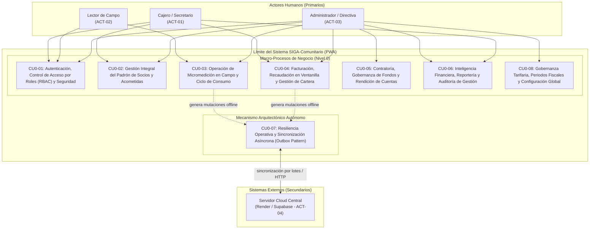

# PROPUESTA DE CASOS DE USO DE NIVEL 0 (INGENIERÍA INVERSA)
## SISTEMA INTEGRAL DE GESTIÓN DE AGUA POTABLE Y ALCANTARILLADO (SIGA-COMUNITARIO)
### Junta Administradora de Agua Potable y Alcantarillado de la Parroquia Pishilata

---

**Disciplina:** Ingeniería Inversa de Requerimientos de Software (Reverse Engineering & Requirements Engineering)  
**Marco Metodológico:** Modelo de Metas de Alto Nivel / Resumen de Negocio (Summary Level / Sea Level de Alistair Cockburn) & Estándar IEEE 830 / ISO/IEC/IEEE 29148  
**Origen de Extracción:** Análisis estático y dinámico del código fuente (`apps/client/src`, `apps/server/src`, APIs y esquemas de persistencia) y Contrato de Software formal  
**Documento Relacionado:** [SRS v1.0.0](file:///c:/Users/andre/OneDrive/Escritorio/Proyectos/app_agua/docs/SRS_SIGA_COMUNITARIO_PISHILATA.md) | [Casos de Uso Detallados](file:///c:/Users/andre/OneDrive/Escritorio/Proyectos/app_agua/docs/CASOS_DE_USO_IEEE_SIGA_COMUNITARIO.md)  
**Versión:** 1.0.0 (Propuesta de Línea Base)  
**Fecha:** Octubre de 2026  
**Responsable Técnico:** Ricardo Andrés Monge Miño (Ingeniero de Software)  

---

## 1. INTRODUCCIÓN Y METODOLOGÍA DE INGENIERÍA INVERSA

### 1.1 Justificación y Propósito
El sistema **SIGA-Comunitario** fue concebido y desarrollado directamente para resolver las necesidades operativas, comerciales y de contraloría comunitaria de la Parroquia Pishilata. Al haberse desarrollado bajo un flujo enfocado en prototipado y validación de campo ágil sin una fase previa formal de Ingeniería de Requerimientos (IR), resulta mandatorio realizar un proceso de **Ingeniería Inversa** del software ya construido y desplegado en producción.

El propósito de este documento es:
1. Extraer, categorizar y sintetizar desde el código fuente real las macro-funcionalidades y metas de negocio del aplicativo.
2. Definir formalmente los **Casos de Uso de Nivel 0 (Nivel Resumen / Enterprise Level)** que rigen la gobernanza global del sistema.
3. Incorporar de manera explícita el macro-caso de uso transversal de **Autenticación, Seguridad y Control de Acceso Basado en Roles (RBAC)**, identificado como pilar central en los archivos `auth.js`, `login.html`, `middlewares/auth.ts` y controladores de administración.
4. Establecer la base de comunicación de alto nivel entre la Junta Directiva (Presidente, Secretaria, Tesorero) y el equipo técnico.

### 1.2 ¿Qué es un Caso de Uso de Nivel 0?
En la jerarquía estándar de especificación de casos de uso (definida por Alistair Cockburn y adoptada en marcos RUP e IEEE):
* **Nivel 0 (Nivel Resumen / Summary / Cloud Goal):** Representa un objetivo comercial o de negocio end-to-end de gran escala. No describe clics ni detalles de pantallas particulares; en su lugar, agrupa una colección completa de objetivos de usuario de Nivel 1 que ocurren a lo largo del tiempo para completar una meta organizacional (ej. "Administrar el Ciclo Mensual de Cobranza").
* **Nivel 1 (Nivel Meta de Usuario / Sea Level / User-Goal):** Representa una tarea concreta que un usuario realiza en una sola sesión para lograr un resultado tangible (ej. "Registrar Pago de Planilla en Caja").
* **Nivel 2 (Subfunción / Fish Level):** Pasos atómicos o algoritmos internos (ej. "Validar Algoritmo de Módulo 10 de Cédula").

---

## 2. ACTORES IDENTIFICADOS MEDIANTE INGENIERÍA INVERSA

A través de la inspección de los módulos de autenticación (`auth.js`), navegación compartida (`shared-layout.js`) y controladores del servidor (`adminController.ts`, `waterController.ts`, `financeController.ts`), se identifican los siguientes actores de negocio:

| Identificador | Actor de Negocio | Rol en Sistema (`rol`) | Nivel de Privilegios | Vistas Asociadas |
| :--- | :--- | :--- | :--- | :--- |
| **ACT-01** | **Cajero / Secretario** | `CAJERO` | Operativo / Administrativo | `caja.html`, `socios.html`, `reportes.html` |
| **ACT-02** | **Lector (Operador de Campo)** | `LECTOR` | Operativo de Campo (Móvil) | `lecturas.html` (restringido de finanzas) |
| **ACT-03** | **Administrador / Directiva** | `ADMIN` | Gobernanza y Contraloría Total | `admin.html`, `fondos.html`, `socios.html`, `reportes.html`, `caja.html` |
| Identificador | Actor de Negocio | Rol en Sistema (`rol`) | Tipo de Actor | Vistas / Alcance |
| :--- | :--- | :--- | :--- | :--- |
| **ACT-01** | **Cajero / Secretario** | `CAJERO` | Humano (Primario) | `caja.html`, `socios.html`, `reportes.html` |
| **ACT-02** | **Lector (Operador de Campo)** | `LECTOR` | Humano (Primario) | `lecturas.html` (restringido de finanzas) |
| **ACT-03** | **Administrador / Directiva** | `ADMIN` | Humano (Primario) | `admin.html`, `fondos.html`, `socios.html`, `reportes.html`, `caja.html` |
| **ACT-04** | **Servidor Cloud Central (Render / Supabase)** | *API / Backend* | Sistema Externo (Secundario) | Endpoint `/api/v1/sync`, PostgreSQL canónico |
| **ACT-05** | **Socio Comunitario (Cliente)** | *Externo* | Humano (Beneficiario) | Receptor de comprobantes y estados de cuenta |

> **Nota Metodológica de Modelado UML:**  
> En el estándar UML de la OMG, un **Actor** debe residir estrictamente **fuera del límite del sistema** (*System Boundary*). Por ello, el motor asíncrono de la PWA (`SyncEngine`, Service Worker, IndexedDB) **no es un actor**, sino un **componente arquitectónico interno**. La sincronización se ejecuta de forma transparente y autónoma en nombre del **Lector** (o **Cajero**) cuando el navegador detecta el evento de red `online`, comunicándose con el actor secundario externo: el **Servidor Cloud Central**.

---

## 3. DIAGRAMA GENERAL DE CASOS DE USO DE NIVEL 0 (UML)

---

## 4. ESPECIFICACIÓN DETALLADA DE CASOS DE USO DE NIVEL 0

---

### [CU0-01] Autenticación, Control de Acceso por Roles (RBAC) y Seguridad de Sesión
*(Requerimiento específico detectado en la ingeniería inversa)*

* **Identificador:** CU0-01
* **Nombre:** Autenticación de Usuarios, Control de Acceso Basado en Roles (RBAC) y Protección de Sesión
* **Nivel:** Nivel 0 (Transversal / Seguridad y Gobernanza de Acceso)
* **Actores Involucrados:** Cajero/Secretario (ACT-01), Lector (ACT-02), Administrador/Directiva (ACT-03).
* **Componentes de Código Fuente Descubiertos:**
  - Cliente: `apps/client/auth.js`, `apps/client/login.html`, `apps/client/login.css`, `apps/client/shared-layout.js`.
  - Servidor: `apps/server/src/middlewares/auth.ts`, `apps/server/src/controllers/authController.ts`, endpoints `/api/v1/auth/login`, `/api/v1/auth/me`.
* **Propósito y Contexto de Negocio:**
  Garantizar que el acceso a los datos financieros, padrón de beneficiarios y operaciones de campo esté estrictamente restringido de acuerdo con el perfil y las facultades estatutarias de cada funcionario de la Junta Administradora. Debe permitir autenticación dual: mediante token JWT con la API central cuando existe red, o mediante credenciales locales cifradas/firmadas cuando el dispositivo opera desconectado en campo.
* **Resumen de Capacidades y Metas que Agrupa:**
  1. **Autenticación Dual (Online / Offline):** Validación de identidad contra la base PostgreSQL remota o contra el almacén local del navegador (`USERS_SEED` de contingencia).
  2. **Control de Acceso Basado en Roles (RBAC):** Restricción estricta de rutas mediante la guardia `requireAuth(['ROLES'])`:
     - El rol `LECTOR` solo tiene acceso concedido a la pantalla operativa `lecturas.html`. El sistema bloquea activamente su ingreso a finanzas, caja, padrón o reportes.
     - El rol `CAJERO` accede a la cobranza en ventanilla (`caja.html`), administración de socios (`socios.html`) y reportes operativos (`reportes.html`).
     - El rol `ADMIN` dispone de privilegios ilimitados de configuración (`admin.html`), libros contables (`fondos.html`) y gobernanza tarifaria.
  3. **Seguridad y Blindaje de Sesión:** Inyección dinámica de menú según rol (`injectAppLayout`), caducidad de token JWT, prevención de almacenamiento no autorizado y mitigación de fuga por historial mediante control de `bfcache` (Back-Forward Cache del navegador).
  4. **Cierre Seguro de Sesión (Logout):** Purgado atómico de `localStorage`, `sessionStorage` y redirección inmediata a `login.html`.
* **Casos de Uso de Nivel 1 que Contiene:**
  - `CU1-AUTH-01`: Iniciar Sesión en Modo Online (JWT Bearer Token).
  - `CU1-AUTH-02`: Iniciar Sesión en Modo Offline / Campo (Contingencia PWA).
  - `CU1-AUTH-03`: Validar Permisos y Proteger Rutas según Rol (Route Guard).
  - `CU1-AUTH-04`: Cerrar Sesión y Revocar Credenciales Locales.
  - `CU1-AUTH-05`: Administrar Cuentas de Usuarios del Sistema (Crear, Editar, Desactivar).

---

### [CU0-02] Gestión Integral del Padrón Comunitario de Socios y Acometidas

* **Identificador:** CU0-02
* **Nombre:** Gestión Integral del Padrón de Socios, Acometidas y Derechos de Red
* **Nivel:** Nivel 0 (Ciclo de Vida del Beneficiario)
* **Actores Involucrados:** Cajero / Secretario (ACT-01), Administrador (ACT-03).
* **Componentes de Código Fuente Descubiertos:**
  - Cliente: `apps/client/socios.html`, `apps/client/socios.js`.
  - Servidor: `apps/server/src/controllers/waterController.ts`, endpoints `/api/v1/socios`, `/api/v1/sectores`, `/api/v1/medidores`.
* **Propósito y Contexto de Negocio:**
  Mantener la base canónica de todos los miembros de la comunidad con derechos de servicio de agua potable y red de alcantarillado, garantizando la trazabilidad geográfica por sectores y la aplicación justa de las leyes ecuatorianas de protección a personas adultas mayores.
* **Resumen de Capacidades y Metas que Agrupa:**
  1. **Identificación y Validación Registral:** Registro de socios con verificación automática del número de cédula bajo el algoritmo de módulo 10 de Ecuador.
  2. **Detección Automática de Beneficio de Tercera Edad:** Cálculo computarizado de la edad según la fecha de nacimiento para asignar de oficio el subsidio tarifario a los 65 años cumplidos.
  3. **Gestión de Servicios Especiales y Acometidas:** Marcado de conexión a la red de alcantarillado comunitaria y vinculación de medidores de agua con código de serie único.
  4. **Zonificación Territorial:** Asignación de socios a sectores y rutas geográficas (Vía Principal, Quillán, etc.) para optimizar las rutas de medición y la segmentación de recaudación.
* **Casos de Uso de Nivel 1 que Contiene:**
  - `CU1-PAD-01`: Registrar Nuevo Socio y Acometida.
  - `CU1-PAD-02`: Modificar Datos del Socio y Reasignar Medidor.
  - `CU1-PAD-03`: Activar o Desactivar Servicio de Red de Alcantarillado.
  - `CU1-PAD-04`: Consultar Ficha Histórica, Expediente y Estado de Cuenta del Socio.

---

### [CU0-03] Operación de Micromedición en Campo y Ciclo de Consumo

* **Identificador:** CU0-03
* **Nombre:** Gestión del Ciclo Operativo de Micromedición y Consumo en Campo
* **Nivel:** Nivel 0 (Logística Operativa de Campo)
* **Actores Involucrados:** Lector de Campo (ACT-02), Administrador (ACT-03).
* **Componentes de Código Fuente Descubiertos:**
  - Cliente: `apps/client/lecturas.html`, `apps/client/lecturas.js`, `apps/client/offline_seed.json`.
  - Servidor: `apps/server/src/controllers/waterController.ts`, endpoints `/api/v1/lecturas`, `/api/v1/lecturas/batch`.
* **Propósito y Contexto de Negocio:**
  Permitir la captura sistemática del volumen de agua consumido en cada domicilio por medio de rutas ordenadas, asegurando la continuidad matemática de los ciclos de lectura y operando con total independencia de las redes celulares o cobertura de internet.
* **Resumen de Capacidades y Metas que Agrupa:**
  1. **Preparación de Rutas Offline:** Descarga y almacenamiento en caché de la ruta de medidores del mes en el dispositivo móvil del operador.
  2. **Captura Volumétrica Domiciliaria:** Ingreso de la lectura visible en el cuadrante del medidor y registro de novedades físicas (fugas, medidores trancados o empañados).
  3. **Continuidad Estricta de Ciclos:** Encadenamiento algorítmico obligatorio donde la Lectura Actual del ciclo $N-1$ se convierte automáticamente en la Lectura Anterior del ciclo $N$.
  4. **Validación de Consistencia y Saltos:** Detección de inconsistencias (lecturas menores a la anterior o consumos atípicos superiores a 100 $m^3$) exigiendo confirmación justificada.
* **Casos de Uso de Nivel 1 que Contiene:**
  - `CU1-LEC-01`: Cargar y Visualizar Ruta de Lecturas del Sector.
  - `CU1-LEC-02`: Registrar Lectura Actual y Novedad de Campo en Medidor.
  - `CU1-LEC-03`: Resolver Alerta de Inconsistencia o Reseteo de Medidor.
  - `CU1-LEC-04`: Traspasar Lecturas Verificadas al Módulo de Caja / Facturación.

---

### [CU0-04] Facturación, Recaudación en Ventanilla y Gestión de Cartera

* **Identificador:** CU0-04
* **Nombre:** Gestión Integral de Facturación Mensual, Cobranza en Caja y Amortización de Deudas
* **Nivel:** Nivel 0 (Comercial y Recaudación de Ingresos)
* **Actores Involucrados:** Cajero / Secretario (ACT-01), Socio Comunitario (ACT-05).
* **Componentes de Código Fuente Descubiertos:**
  - Cliente: `apps/client/caja.html`, `apps/client/caja.js`, `apps/client/comprobante.js`.
  - Servidor: `apps/server/src/controllers/waterController.ts`, `apps/server/src/controllers/comprobanteController.ts`, endpoints `/api/v1/facturas`, `/api/v1/facturas/cobrar`, `/api/v1/multas`.
* **Propósito y Contexto de Negocio:**
  Liquidar los consumos mensuales de agua potable aplicando los parámetros contractuales (base de 30 $m^3$, excedentes a $0.10/m^3$, tarifa normal de $7.00 vs subsidiada de $5.00 y recargo de alcantarillado de $1.00), recaudar los montos en ventanilla y permitir abonos parciales respetando el principio de cobro cronológico por antigüedad.
* **Resumen de Capacidades y Metas que Agrupa:**
  1. **Liquidación Algorítmica de Planillas:** Generación automática de planillas mensuales computando base, excedentes volumétricos, alcantarillado, multas comunitarias y cuotas extraordinarias.
  2. **Cobro Total en Ventanilla:** Registro de recaudación monetaria por diversos métodos de pago (Efectivo, Transferencia).
  3. **Amortización No Destructiva por Abonos Parciales (FIFO):** Aplicación de pagos parciales imputados cronológicamente desde la deuda más antigua, manteniendo inalteradas las facturas posteriores.
  4. **Consolidación de Cartera Vencida:** Trazabilidad de los meses en mora con fechas exactas de emisión y consolidación del saldo deudor total.
  5. **Emisión de Comprobantes de Pago:** Impresión digital o física de recibos oficiales con el desglose exigido por los estatutos de la Junta.
* **Casos de Uso de Nivel 1 que Contiene:**
  - `CU1-FAC-01`: Emitir y Liquidar Planillas Mensuales del Periodo.
  - `CU1-FAC-02`: Recaudar Pago Total de Planilla en Ventanilla.
  - `CU1-FAC-03`: Procesar Abono Parcial Cronológico (Criterio FIFO).
  - `CU1-FAC-04`: Cargar Multas Comunitarias y Cuotas Extraordinarias.
  - `CU1-FAC-05`: Generar e Imprimir Recibo Oficial de Cobro.

---

### [CU0-05] Contraloría, Gobernanza de Fondos y Rendición de Cuentas

* **Identificador:** CU0-05
* **Nombre:** Contraloría Financiera, Gobernanza de Fondos y Rendición de Cuentas
* **Nivel:** Nivel 0 (Finanzas y Transparencia Contable)
* **Actores Involucrados:** Administrador / Directiva (Tesorero / Presidente - ACT-03).
* **Componentes de Código Fuente Descubiertos:**
  - Cliente: `apps/client/fondos.html`, `apps/client/fondos.js`, `apps/client/fondos.css`.
  - Servidor: `apps/server/src/controllers/financeController.ts`, endpoints `/api/v1/fondos`, `/api/v1/fondos/libro-mayor`, `/api/v1/fondos/egreso`, `/api/v1/fondos/liquidacion-padre`.
* **Propósito y Contexto de Negocio:**
  Blindar los recursos de la comunidad garantizando que cada dólar recaudado en ventanilla se distribuya con rigor matemático hacia las cuentas designadas (Promejoras, Aporte Parroquial, Mantenimiento, Mortuorio, Lector y Alcantarillado), disponiendo de libros mayores transparentes para rendición de cuentas en asambleas.
* **Resumen de Capacidades y Metas que Agrupa:**
  1. **Distribución Automática de la Tarifa Base:** Desglose algorítmico al momento del cobro:
     - En tarifa estándar ($7.00): $2.00 Parroquia, $4.00 Mantenimiento, $0.50 Lector, $0.50 Fondo Mortuorio.
     - En tarifa 3ra edad ($5.00): $2.00 Parroquia, $2.00 Mantenimiento, $0.50 Lector, $0.50 Fondo Mortuorio.
  2. **Destinación Íntegra al Fondo de Promejoras:** Asignación automática del 100% de la recaudación por concepto de consumo excedente ($0.10/m³) para obras comunales.
  3. **Fondo Especial de Alcantarillado:** Canalización exclusiva del 100% de los valores cobrados por alcantarillado ($1.00) para el mantenimiento de la red.
  4. **Seguimiento y Liquidación del Aporte Eclesiástico:** Cuenta analítica para la Iglesia de Pishilata que controla lo devengado, los desembolsos entregados al Padre y los saldos pendientes.
  5. **Libro Mayor Contable a Tres Columnas:** Auditoría financiera completa para cada fondo bajo la estructura formal: *Ingresos (Haber)*, *Egresos (Debe)* y *Saldo Acumulado Consolidado*.
* **Casos de Uso de Nivel 1 que Contiene:**
  - `CU1-CON-01`: Desglosar Ingresos por Cobranza en Fondos Específicos.
  - `CU1-CON-02`: Auditar Libro Mayor de Fondos (Promejoras, Operación, Mortuorio, etc.).
  - `CU1-CON-03`: Registrar Desembolso o Liquidación de Aporte Parroquial (Padre).
  - `CU1-CON-04`: Registrar Egreso Operativo Justificado de un Fondo Comunitario.

---

### [CU0-06] Inteligencia Financiera, Reportería y Auditoría de Gestión

* **Identificador:** CU0-06
* **Nombre:** Inteligencia Financiera, Reportería Periódica y Auditoría Comunitaria
* **Nivel:** Nivel 0 (Reportería Estratégica y Cumplimiento Normativo)
* **Actores Involucrados:** Administrador / Directiva (ACT-03), Cajero / Secretario (ACT-01).
* **Componentes de Código Fuente Descubiertos:**
  - Cliente: `apps/client/reportes.html`, `apps/client/reportes.js`, `apps/client/reportes.css`.
  - Servidor: `apps/server/src/controllers/reportesController.ts`, endpoints `/api/v1/reportes/consolidado`, `/api/v1/reportes/sector`, `/api/v1/reportes/morosidad`.
* **Propósito y Contexto de Negocio:**
  Proporcionar métricas analíticas e informes consolidados fidedignos sobre la situación hídrica y económica de la junta para cumplir con los requerimientos contractuales de periodicidad (trimestral, semestral y anual) y alimentar las asambleas generales de socios.
* **Resumen de Capacidades y Metas que Agrupa:**
  1. **Balances Consolidados Temporales:** Generación de resúmenes de recaudación, egresos y saldos en frecuencias periódicas contractuales (Trimestral, Semestral y Anual).
  2. **Segmentación Geográfica de Consumo y Cobro:** Reportes analíticos desagregados por sector territorial para evaluar índices de morosidad y patrones de consumo.
  3. **Análisis de Morosidad y Deuda:** Identificación de cartera vencida por socio, sectores críticos y antigüedad de adeudos.
  4. **Pistas de Auditoría y Trazabilidad:** Registro inmutable de transacciones, anulaciones, fechas y responsables de cada operación.
* **Casos de Uso de Nivel 1 que Contiene:**
  - `CU1-REP-01`: Generar Balance Consolidado Trimestral, Semestral o Anual.
  - `CU1-REP-02`: Generar Reporte de Recaudación y Morosidad por Sector.
  - `CU1-REP-03`: Exportar Estados Financieros y Métricas de Consumo Volumétrico.

---

### [CU0-07] Resiliencia Operativa y Sincronización Offline-First (Mecanismo PWA)

* **Identificador:** CU0-07
* **Nombre:** Resiliencia Operativa Local y Sincronización Asíncrona Fuera de Línea
* **Nivel:** Nivel 0 (Mecanismo Arquitectónico Transversal / Infraestructura)
* **Actores Involucrados:** 
  - **Actor Primario Desencadenante (Humano):** Lector de Campo (ACT-02) / Cajero (ACT-01) [quienes generan las mutaciones de datos en campo o ventanilla].
  - **Disparador del Entorno (Evento):** Detección de conectividad de red (`window.onLine`).
  - **Actor Secundario Receptor (Sistema Externo):** Servidor Cloud Central (Supabase / Render - ACT-04).
* **Componentes de Código Fuente Descubiertos:**
  - Cliente: `apps/client/sync-engine.js`, `apps/client/sw.js`, `apps/client/manifest.json`, IndexedDB (`siga_offline_db`).
  - Servidor: `apps/server/src/routes/syncRoutes.ts`, `apps/server/src/db/supabase.ts`, endpoint `POST /api/v1/sync`.
* **Propósito y Contexto de Negocio:**
  Garantizar que la aplicación funcione de manera ininterrumpida y con latencia ultrabaja (<50 ms) aun cuando la geografía rural de Pishilata carezca de señal celular o internet, preservando los datos de forma atómica en el dispositivo y replicándolos de forma segura en la nube central (Supabase PostgreSQL / Render) al reconectarse.
* **Resumen de Capacidades y Metas que Agrupa:**
  1. **Persistencia Primaria en IndexedDB:** Escritura y lectura local inmediata sin bloqueo de interfaz.
  2. **Patrón Outbox (`sync_queue`):** Encolamiento transaccional de cada mutación (`CREATE`, `UPDATE`, `DELETE`) en estado `PENDING`.
  3. **Sincronización Inteligente por Lotes:** Detección de red (`online`), despacho en lotes comprimidos de hasta 50 registros y recepción de reconocimientos (ACKs).
  4. **Resolución Determinista de Conflictos:** Algoritmo LWW (Last-Write-Wins) basado en marcas de tiempo ISO y versiones para garantizar coherencia multiusuario.
* **Casos de Uso de Nivel 1 que Contiene:**
  - `CU1-PWA-01`: Persistir Transacciones Atómicas en IndexedDB Local.
  - `CU1-PWA-02`: Encolar y Despachar Lotes de Sincronización (Outbox Pattern).
  - `CU1-PWA-03`: Resolver Conflictos de Concurrencia de Datos (LWW).
  - `CU1-PWA-04`: Gestionar Caché Local y Assets Críticos mediante Service Worker.

---

### [CU0-08] Gobernanza Tarifaria, Periodos Fiscales y Configuración Global

* **Identificador:** CU0-08
* **Nombre:** Gobernanza Tarifaria, Gestión de Periodos Fiscales y Parametrización Global
* **Nivel:** Nivel 0 (Configuración Estratégica del Negocio)
* **Actores Involucrados:** Administrador / Directiva (ACT-03).
* **Componentes de Código Fuente Descubiertos:**
  - Cliente: `apps/client/admin.html`, `apps/client/admin.js`.
  - Servidor: `apps/server/src/controllers/adminController.ts`, endpoints `/api/v1/admin/tarifas`, `/api/v1/periodos`, `/api/v1/periodos/avanzar`.
* **Propósito y Contexto de Negocio:**
  Permitir que la directiva de la junta ajuste los valores de las tarifas según resoluciones de asamblea, controle la apertura/cierre de ciclos mensuales de facturación y administre los catálogos territoriales.
* **Resumen de Capacidades y Metas que Agrupa:**
  1. **Parametrización Tarifaria:** Ajuste configurable de la tarifa estándar ($7.00), tarifa de tercera edad ($5.00), base fija en $m^3$ (30 $m^3$), costo de excedente ($0.10/m³), recargo de alcantarillado ($1.00) y desglose de fondos.
  2. **Control de Ciclos y Periodos de Facturación:** Apertura de periodos nuevos ($AAAA-MM$), cierre de ciclo lectivo, avance de lecturas hacia el módulo de cobro y bloqueo de periodos históricos.
  3. **Mantenimiento de Catálogos Territoriales:** Creación y modificación de códigos y nombres de sectores.
* **Casos de Uso de Nivel 1 que Contiene:**
  - `CU1-ADM-01`: Parametrizar Tarifas, Límites y Reglas de Distribución Contable.
  - `CU1-ADM-02`: Abrir, Cerrar y Avanzar Periodo Fiscal de Facturación.
  - `CU1-ADM-03`: Gestionar Sectores Geográficos y Rutas de Distribución.

---

## 5. MATRIZ DE DESCOMPOSICIÓN FUNCIONAL (NIVEL 0 vs NIVEL 1)

La siguiente matriz presenta el mapa completo de trazabilidad entre los macro-casos de uso identificados mediante ingeniería inversa y las funcionalidades de usuario específicas:

| Caso de Uso Nivel 0 (Macro-Proceso) | Casos de Uso de Nivel 1 (Meta de Usuario) | Archivo Fuente Frontend | Controlador / Ruta Backend |
| :--- | :--- | :--- | :--- |
| **CU0-01: Autenticación, RBAC y Seguridad** | - Iniciar Sesión Online (JWT) - Iniciar Sesión Offline (Seed Fallback) - Control de Acceso por Roles (Route Guard) - Cerrar Sesión y Revocar Credenciales - Administrar Cuentas de Usuario | `auth.js` `login.html` `shared-layout.js` | `authController.ts` `adminController.ts` `/api/v1/auth/*` |
| **CU0-02: Gestión del Padrón de Socios** | - Registrar Nuevo Socio y Acometida - Evaluar Condición de Tercera Edad - Asignar Red de Alcantarillado - Consultar Ficha y Estado de Cuenta | `socios.html` `socios.js` | `waterController.ts` `/api/v1/socios` `/api/v1/sectores` |
| **CU0-03: Micromedición en Campo** | - Cargar Ruta Offline en Dispositivo - Registrar Lectura y Novedad de Medidor - Validar Continuidad de Ciclos ($L_{act} \ge L_{ant}$) - Pasar Lecturas a Facturación | `lecturas.html` `lecturas.js` | `waterController.ts` `/api/v1/lecturas` `/api/v1/lecturas/batch` |
| **CU0-04: Facturación y Cobranza** | - Liquidar Planillas del Periodo - Cobrar Planilla en Ventanilla - Registrar Abono Parcial Cronológico (FIFO) - Cargar Multas Comunitarias y Cuotas - Emitir Recibo Oficial de Cobro | `caja.html` `caja.js` `comprobante.js` | `waterController.ts` `comprobanteController.ts` `/api/v1/facturas/*` |
| **CU0-05: Contraloría y Fondos** | - Desglosar Tarifa Base en Fondos Contables - Acreditar Excedentes a Promejoras (100%) - Liquidar Aporte Parroquial (Padre) - Auditar Libro Mayor a Tres Columnas | `fondos.html` `fondos.js` | `financeController.ts` `/api/v1/fondos/*` |
| **CU0-06: Reportería y Auditoría** | - Generar Balance Trimestral, Semestral y Anual - Segmentar Recaudación por Sector / Socio - Analizar Índices de Morosidad y Volumen | `reportes.html` `reportes.js` | `reportesController.ts` `/api/v1/reportes/*` |
| **CU0-07: Resiliencia Offline (PWA)** | - Persistir en IndexedDB (`siga_offline_db`) - Encolar y Despachar Lotes (`sync_queue`) - Resolver Conflictos Concurrencia (LWW) - Gestión de Caché en Service Worker | `sync-engine.js` `sw.js` | `syncRoutes.ts` `supabase.ts` `/api/v1/sync` |
| **CU0-08: Gobernanza Administrativa** | - Parametrizar Esquema Tarifario Comunitario - Apertura, Cierre y Avance de Periodos - Mantenimiento de Sectores Territoriales | `admin.html` `admin.js` | `adminController.ts` `/api/v1/admin/*` `/api/v1/periodos` |

---

## 6. CONCLUSIONES Y RECOMENDACIONES DE INGENIERÍA DE REQUERIMIENTOS

1. **Madurez del Modelo de Negocio:** La ingeniería inversa demostró que el software cuenta con una delimitación de responsabilidades sólida y desacoplada, respaldada por un motor financiero que traduce fielmente el marco contractual del agua comunitaria.
2. **Relevancia del Módulo de Autenticación y RBAC (`CU0-01`):** La separación de roles entre `LECTOR`, `CAJERO` y `ADMIN` está codificada no solo en la interfaz gráfica mediante redirecciones, sino en los middlewares del backend y en el comportamiento de la PWA desconectada, blindando la confidencialidad de la información comunitaria.
3. **Consistencia de la Arquitectura Offline-First (`CU0-07`):** El patrón Outbox (`sync_queue`) en combinación con IndexedDB provee una resiliencia indispensable para la geografía de Pishilata, permitiendo que la toma de lecturas en campo y la caja operen sin depender de la conectividad en tiempo real.
4. **Adopción Oficial:** Se recomienda formalizar esta propuesta de Casos de Uso de Nivel 0 como la arquitectura funcional de referencia para futuras fases de mantenimiento, auditorías técnicas y manuales de capacitación de la Junta Administradora.